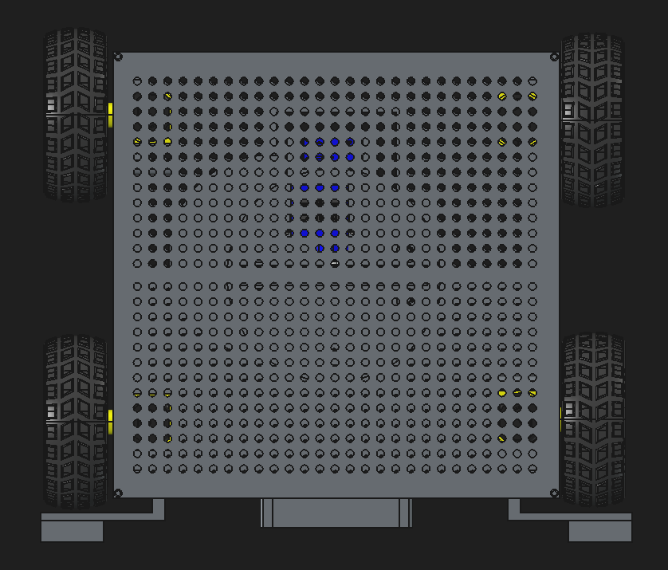
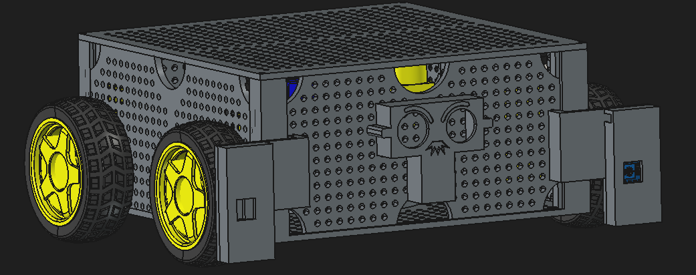
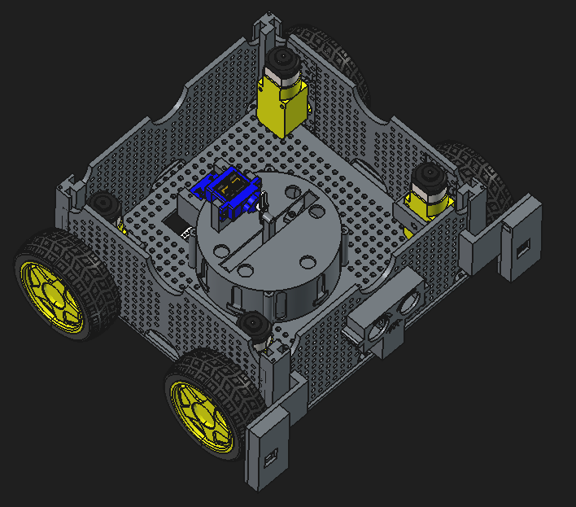
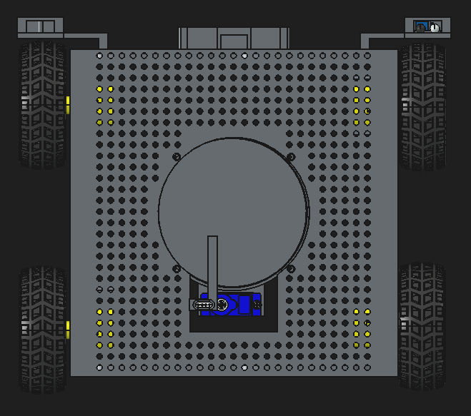

# Coasterbot – Konzeptbeschreibung

## 1. Übersicht

Der Coasterbot ist ein mobiler Roboter auf einem vierrädrigen Chassis, dessen zentrale
Funktion die **Aufnahme und Ausgabe von Untersetzern** ist. Der Roboter ist mit einem
Lochraster-Chassis aufgebaut, das eine flexible Montage von Elektronik, Sensorik und
Mechanik erlaubt. Aus diesem Grund sind in den folgenden Bildern noch nicht alle Komponenten sichtbar. Deren ideale Platzierung kann am Prototyp variieren und so der optimale Platz gefunden werden. Vier einzeln angetriebene Räder sorgen für die Fortbewegung, während
im Zentrum des Fahrzeugs ein Mechanismus zur Untersetzerhandhabung
untergebracht ist.

## 2. Gesamtkonzept

Die folgenden Übersichten zeigen das grundlegende Layout des Roboters aus der
Vogelperspektive sowie von vorne.

### Draufsicht (Konzept)

Die Draufsicht zeigt die symmetrische Anordnung der vier Räder in den Ecken des
Chassis. Die blau durchscheinende
Bereiche kennzeichnen die Position der Servomotoren für die Ausgabe und Aufnahme von Untersetzer, die gelb durchscheinenden Bereiche sind die verwendeten Antriebsmotoren zur Fortbewegung. Befestigt wird die obere Platte über vier Schrauben an das Grundgestell. Damit Klemmt diese obere Platte vier Seitenwände in das Grundgestell ein. 

### Frontansicht (Konzept)

Die Frontansicht verdeutlicht das Fahrzeug sowie die Anbringung der
Sensoren zur Kanten- und Hinderniserkennung. Mittig ist eine stilisierte „Gesichts"-Blende zu erkennen, welche einen Ultraschallsensor aufnehmen kann zur Hinderniserkennung. Die vor den Rädern stehenden Gehäuse sind zur Aufnahme der Sensorik zur Kantenerkennung gedacht. Diese werden auch für die hinteren Räder vorgesehen. Die Antriebsräder werden direkt mit den Außenwänden verschraubt. Alle Außenwände werden von oben in das Grundgestell eingeschoben. Die ist an den Führungen in den Eckpfeilern erkennbar.

## 3. Mechanischer Aufbau

### Isometrische Ansicht ohne Deckel

Diese Darstellung zeigt den Innenaufbau des Roboters ohne die obere Abdeckung. Im
Zentrum ist die runde Aufnahme- und Ausgabemechanik für die Untersetzer zu erkennen.
Sie besteht aus einer beweglichen Scheibe mit mehreren eingelassenen Magneten. Über einen Servomotor und einen Schubkurbeltrieb. Dieser Schubkurbeltrieb lässt die bewegliche Scheine auf und ab verfahren. Durch die Magneten können entsprechende Untersetzer aufgenommen werden. Es wird ausreichend Platz vorgesehen, dass wenigsten vier Untersetzer in dieser Mechanik vorgehalten werden.

An den vier Ecken des Chassis sind die Antriebsmotoren der Räder zu sehen. Die Räder
selbst sind mit gelben Felgen ausgestattet und an seitlichen Halterungen befestigt.

### Untere Ansicht

Zentral erkennbar ist die
Unterseite der Untersetzer-Mechanik mit dem herausragenden Auswurf-/Führungssteg sowie
dem blauen Servomotor darunter. Wird ein Untersetzer ausgegeben, wird dieser soweit heruntergelassen, dass er auf dem Führungssteg abliegt. Damit wird eine sichere Ausrichtung des Untersetzer gewahrt. Anschließen rotiert der Servomotor um 90° wodurch die kurze Seite den Untersetzer nach vorne schiebt. Durch ein anschließendes Anheben des Hebemechanismus, kann der Untersetze abgelegt werden. Wird ein Untersetzer wieder aufgenommen, dreht sich der Ausschieber weitere 90° zur Seite, damit der Heber an der Mechanik vorbeikommt. Dadurch kann der Heber soweit heruntergefahren werden, bis die Magneten den sich darunter befindlichen Untersetzer anziehen und damit aufnehmen. Befestigt wird die Mechanik mit dem Gehäuse über vier Schrauben.

## 4. Komponentenübersicht

| Komponente | Funktion | Position |
|---|---|---|
| Zentrale Hebe-Mechanik | Aufnahme und Ausgabe der Untersetzer | Fahrzeugmitte |
| Servomotor zum heben | Antrieb der zentralen Aufnahme-/Ausgabescheibe | Oberhalb der Drehscheibe |
| 4× Radantriebsmotoren | Fortbewegung des Roboters | Je Rad, in den vier Ecken |
| HC-05-Board | Abstandssensor (Front) | Fahrzeugfront, hinter der „Gesichts"-Blende |
| LM393-Board (in der Anfrage als „LM939" bezeichnet) | Kantenerkennung / Abgrunderkennung | Vor jedem der vier Räder, nicht dargestellt |
| Lochraster-Chassis | Trägerstruktur, flexible Montage aller Komponenten | Ober- und Unterseite des Fahrzeugs |
| Inertialsensor | Orientierung im Raum | Im Innenraum, nicht dargestellt |
| Recheneinheit | Auswertung und Steuerung | Im Innenraum, nicht dargestellt |
| Energieversorgung | Versorgung der Steuerung, Sensorik und Aktorik mit Energie | Im Innenraum, nicht dargstellt

## 5. Funktionsprinzip (geplant)

1. Der Roboter bewegt sich mittels der vier Radantriebe autonom im Raum.
2. Die Kantenerkennungssensoren (vor jedem Rad) verhindern das Herunterfahren von
   Kanten oder Stufen.
3. Der Abstandssensor an der Front erkennt Hindernisse bzw. Personen/Tische, an die
   ein Untersetzer ausgegeben werden soll.
4. Die zentrale Hebe-Mechanik gibt an der Zielposition einen Untersetzer aus bzw. nimmt
   einen leeren/benutzten Untersetzer wieder auf.
5. Über einen Inertialsensor wird der Verfahrweg aufgenommen und zur Orientierung verwendet.

## 6. Offene Punkte

- Hinzufügen der fehlenden zwei LM393-Kantenerkennungssensoren.
- Verkabelung und Steuerungslogik (Mikrocontroller, Motortreiber) sind noch nicht dargestellt.
- Positionierung der Steurung, Energieversorgung und Inertialsensorik
