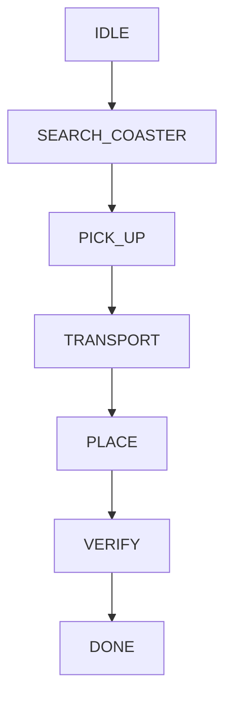

# 1 Einleitung

## 1.1 Zweck des Pflichtenhefts

Dieses Pflichtenheft beschreibt die technische Umsetzung des im Lastenheft definierten Coasterbot-Prototyps. Es dient als verbindliche Grundlage für die Entwicklung der Systemarchitektur, der Hardwarekomponenten, der Softwarekomponenten sowie der Simulationsumgebung.

Während das Lastenheft die Anforderungen und Ziele des Auftraggebers beschreibt, legt dieses Dokument die geplante Realisierung des Systems fest. Es beschreibt die Architekturentscheidungen, die Aufteilung des Systems in einzelne Komponenten sowie die vorgesehenen Verfahren zur Umsetzung und Verifikation der geforderten Funktionen.

Das Pflichtenheft dient allen an der Entwicklung beteiligten Personen als technische Referenz und ermöglicht eine nachvollziehbare Verbindung zwischen Anforderungen, Implementierung und Tests.

## 1.2 Projektbeschreibung

Im Rahmen der Projektarbeit wird ein Prototyp eines autonomen mobilen Roboters entwickelt, der als Coasterbot bezeichnet wird. Der Roboter soll in gastronomischen Umgebungen eingesetzt werden und die Aufgabe übernehmen, Getränkeuntersetzer selbstständig auf einer Tischoberfläche zu transportieren, unter Getränken zu platzieren und wieder aufzunehmen.

Der Fokus der Entwicklung liegt auf der Realisierung eines funktionsfähigen Prototyps mit einer modularen Softwarearchitektur und einer validierbaren Simulationsumgebung. Dabei werden insbesondere die Bereiche autonome Navigation, Lokalisierung, Objekthandhabung, Systemüberwachung und Sicherheit betrachtet.

Die Entwicklung erfolgt nach einem komponentenbasierten Ansatz, bei dem Hardware- und Softwarekomponenten über definierte Schnittstellen miteinander verbunden werden. Dadurch soll eine spätere Erweiterung des Systems um zusätzliche Funktionen wie Bestellaufnahme, Reinigung oder Getränketransport ermöglicht werden.

## 1.3 Zielsetzung

Ziel der technischen Umsetzung ist die Entwicklung eines prototypischen Robotersystems, welches die im Lastenheft definierten Anforderungen des Maturity Level 1 erfüllt.

Hierzu werden folgende Ergebnisse angestrebt:

* Entwicklung einer modularen Softwarearchitektur für die Steuerung des Roboters.
* Entwicklung einer Hardwarearchitektur mit austauschbaren Sensor- und Aktorkomponenten.
* Umsetzung einer Navigations- und Lokalisierungskomponente für den Betrieb auf einer Tischoberfläche.
* Entwicklung einer Komponente zur Aufnahme, Positionierung und Wiederaufnahme von Getränkeuntersetzern.
* Implementierung von Sicherheitsmechanismen zur Vermeidung von Kollisionen und Abstürzen.
* Erstellung einer Simulationsumgebung zur Entwicklung und Validierung der Software.
* Definition und Durchführung von Tests zur Überprüfung der Anforderungen.

Der Schwerpunkt liegt auf dem Nachweis der technischen Machbarkeit und nicht auf der Entwicklung eines serienreifen Produkts.

## 1.4 Technische Zielarchitektur

Der Coasterbot wird als eingebettetes, autonomes Robotersystem umgesetzt. Die geplante Architektur besteht aus mehreren logisch getrennten Ebenen:

### Hardwareebene

Die Hardwareebene umfasst alle physischen Komponenten des Roboters:

* Recheneinheit zur Ausführung der Steuerungssoftware.
* Sensorik zur Erfassung der Umgebung und des Systemzustands.
* Aktorik zur Bewegung und Manipulation von Getränkeuntersetzern.
* Energieversorgung einschließlich Akkumanagement.

### Abstraktionsebene

Die Abstraktionsebene stellt eine einheitliche Schnittstelle zwischen Hardware und Software bereit. Dadurch können konkrete Hardwarekomponenten ausgetauscht werden, ohne die darüberliegenden Softwarekomponenten anpassen zu müssen.

### Steuerungs- und Anwendungsebene

Die Anwendungsebene beinhaltet die eigentliche Systemlogik:

* Navigation
* Lokalisierung
* Bewegungsplanung
* Untersetzerhandling
* Sicherheitslogik
* Systemüberwachung

### Simulationsebene

Die Simulationsebene ermöglicht die Ausführung und Validierung der Software ohne physische Hardware. Dabei werden Sensoren, Aktoren und Umgebungsbedingungen modelliert.

## 1.5 Abgrenzung

Die folgenden Funktionen werden im Rahmen dieser Projektarbeit nicht umgesetzt:

* Automatisierter Getränketransport.
* Automatisierte Tischreinigung.
* Digitale Bestellaufnahme.
* Integration von Bezahlsystemen.
* Kommunikation über externe Netzwerke.
* Kartierung und dauerhafte Speicherung der Umgebung.
* Koordination mehrerer Coasterbots.

Diese Funktionen werden ausschließlich als mögliche Erweiterungen berücksichtigt und beeinflussen die Architektur nur hinsichtlich einer zukünftigen Erweiterbarkeit.

## 1.6 Dokumentstruktur

Das Pflichtenheft ist wie folgt aufgebaut:

**Kapitel 1 – Einleitung**
Beschreibung der Zielsetzung, Aufgabenstellung und Abgrenzung des Projekts.

**Kapitel 2 – Systemarchitektur**
Beschreibung der Gesamtstruktur des Coasterbots sowie der Aufteilung in Hardware- und Softwarekomponenten.

**Kapitel 3 – Hardwarekonzept**
Beschreibung der mechanischen Komponenten, Sensorik, Aktorik und Energieversorgung.

**Kapitel 4 – Softwarekonzept**
Beschreibung der Softwarearchitektur, Komponenten und Schnittstellen.

**Kapitel 5 – Implementierungskonzept**
Beschreibung der geplanten Umsetzung der Kernfunktionen.

**Kapitel 6 – Simulationskonzept**
Beschreibung der Simulationsumgebung und der modellierten Systembestandteile.

**Kapitel 7 – Test- und Verifikationskonzept**
Beschreibung der Teststrategie und Zuordnung von Tests zu Anforderungen.

**Kapitel 8 – Zusammenfassung und Ausblick**
Bewertung der Umsetzung sowie mögliche zukünftige Erweiterungen.

# 2 Systemarchitektur

## 2.1 Ziel der Systemarchitektur

Die Systemarchitektur beschreibt den grundlegenden Aufbau des Coasterbot-Prototyps sowie die Aufteilung des Gesamtsystems in einzelne technische Komponenten. Ziel der Architektur ist es, eine robuste, modulare und erweiterbare Struktur zu schaffen, welche die Umsetzung der im Lastenheft definierten Anforderungen ermöglicht.

Die Architektur folgt einem komponentenbasierten Ansatz mit klar definierten Schnittstellen zwischen den einzelnen Systembestandteilen. Dadurch können einzelne Komponenten unabhängig voneinander entwickelt, getestet und bei Bedarf ausgetauscht werden.

Besondere Bedeutung haben dabei die Trennung von Hardware und Software sowie die Möglichkeit, das System vollständig oder teilweise in einer Simulationsumgebung auszuführen.

## 2.2 Systemaufbau

Der Coasterbot wird als eingebettetes autonomes Robotersystem entwickelt. Das Gesamtsystem wird in mehrere Ebenen unterteilt:

1. Hardwareebene
2. Hardwareabstraktionsebene
3. Systemlogikebene
4. Anwendungsebene
5. Simulationsebene

Die Ebenen sind hierarchisch aufgebaut und kommunizieren ausschließlich über definierte Schnittstellen.

## 2.3 Architekturmodell

### 2.3.1 Hardwareebene

Die Hardwareebene bildet die physische Grundlage des Roboters. Sie umfasst alle Komponenten, die zur Wahrnehmung der Umgebung, zur Bewegung und zur Energieversorgung erforderlich sind.

Die Hardwareebene besteht aus folgenden Hauptkomponenten:

* Recheneinheit
* Sensorik
* Aktorik
* Energieversorgung
* Mechanische Konstruktion

Die Recheneinheit übernimmt die Verarbeitung der Sensordaten sowie die Berechnung der Steuerbefehle für die Aktoren.

Die Sensorik stellt Informationen über den Zustand des Roboters und seiner Umgebung bereit. Dazu gehören insbesondere:

* Erkennung von Hindernissen
* Erkennung der Tischbegrenzung
* Bestimmung der Position und Orientierung
* Erkennung von Getränkeuntersetzern

Die Aktorik setzt die berechneten Steuerbefehle in physische Aktionen um. Dazu gehören:

* Bewegung des Roboters
* Aufnahme eines Getränkeuntersetzers
* Positionierung eines Getränkeuntersetzers

## 2.3.2 Hardwareabstraktionsebene

Die Hardwareabstraktionsebene stellt eine Trennung zwischen der physischen Hardware und der darüberliegenden Softwarelogik her.

Ziel dieser Ebene ist es, die Abhängigkeit der Software von konkreten Hardwarekomponenten zu reduzieren. Dadurch können beispielsweise unterschiedliche Sensoren oder Motoren verwendet werden, ohne die Navigations- oder Steuerungslogik anzupassen.

Die Hardwareabstraktion umfasst:

* Einheitliche Schnittstellen für Sensoren
* Einheitliche Schnittstellen für Aktoren
* Verwaltung der Hardwarekommunikation
* Umwandlung hardwareabhängiger Daten in ein einheitliches Format

Durch diese Struktur können reale Hardwarekomponenten durch Simulationsmodelle ersetzt werden.

## 2.3.3 Systemlogikebene

Die Systemlogikebene beinhaltet die zentralen Funktionen zur Steuerung des Roboters. Sie verarbeitet Informationen aus der Hardwareabstraktion und erzeugt entsprechende Steuerbefehle.

Die wesentlichen Komponenten dieser Ebene sind:

### Navigationskomponente

Die Navigationskomponente ist verantwortlich für die autonome Bewegung des Roboters innerhalb des Arbeitsbereichs.

Aufgaben:

* Planung einer Fahrroute
* Erkennung von Hindernissen
* Anpassung der Route bei Änderungen der Umgebung
* Erreichen definierter Zielpositionen

### Lokalisierungskomponente

Die Lokalisierungskomponente bestimmt die aktuelle Position und Orientierung des Roboters.

Aufgaben:

* Verarbeitung von Sensordaten
* Positionsbestimmung
* Aktualisierung der Roboterpose
* Bereitstellung der Positionsinformationen für andere Komponenten

### Bewegungssteuerung

Die Bewegungssteuerung übersetzt Navigationsentscheidungen in konkrete Bewegungsbefehle.

Aufgaben:

* Steuerung der Motoren
* Geschwindigkeitsregelung
* Begrenzung kritischer Bewegungszustände
* Umsetzung von Sicherheitsanforderungen

### Untersetzerhandling

Diese Komponente steuert die Aufnahme und Ausgabe von Getränkeuntersetzern.

Aufgaben:

* Erkennen eines verfügbaren Untersetzers
* Aktivieren des Aufnahmemechanismus
* Transport des Untersetzers
* Positionierung unter einem Getränk
* Überprüfung der erfolgreichen Platzierung

### Sicherheitskomponente

Die Sicherheitskomponente überwacht sicherheitskritische Zustände.

Aufgaben:

* Erkennen gefährlicher Situationen
* Auslösen eines kontrollierten Stopps
* Überwachung sicherheitsrelevanter Sensoren
* Wechsel in einen sicheren Zustand

### Systemüberwachung

Die Systemüberwachung stellt Informationen über den Betriebszustand bereit.

Aufgaben:

* Erkennung von Fehlern
* Speicherung von Fehlerinformationen
* Überwachung von Systemzuständen
* Meldung fehlgeschlagener Aufgaben

## 2.3.4 Anwendungsebene

Die Anwendungsebene beschreibt die übergeordnete Ablaufsteuerung des Coasterbots.

Sie definiert die Reihenfolge der Systemaktionen und koordiniert die einzelnen Funktionskomponenten.

Beispielhafter Ablauf:

1. Initialisierung des Systems.
2. Überprüfung der Betriebsbereitschaft.
3. Erfassung der Umgebung.
4. Bestimmung eines Zielpunkts.
5. Planung einer Route.
6. Navigation zum Ziel.
7. Aufnahme oder Ausgabe eines Getränkeuntersetzers.
8. Überprüfung des Ergebnisses.
9. Rückmeldung über den Systemstatus.

Die Anwendungsebene enthält keine hardwareabhängigen Funktionen und kommuniziert ausschließlich über definierte Schnittstellen mit den darunterliegenden Komponenten.

## 2.4 Simulationsarchitektur

Die Simulation stellt eine parallele Umgebung zur realen Hardware dar. Ziel ist es, die Softwarekomponenten unabhängig vom physischen Prototyp entwickeln und testen zu können.

Die Simulationsarchitektur umfasst:

### Umgebungsmodell

Das Umgebungsmodell beschreibt die virtuelle Tischoberfläche sowie darauf befindliche Objekte.

Modelliert werden:

* Tischgrenzen
* Hindernisse
* Getränke
* Getränkeuntersetzer

### Sensormodelle

Sensormodelle erzeugen virtuelle Sensordaten entsprechend der simulierten Umgebung.

Beispiele:

* Abstandswerte
* Positionserkennung
* Hinderniserkennung
* Tischkantenerkennung

### Aktormodelle

Aktormodelle bilden das Verhalten realer Aktoren nach.

Beispiele:

* Motorbewegungen
* Geschwindigkeit
* Aufnahme- und Ablegebewegungen

### Teststeuerung

Die Teststeuerung ermöglicht die Durchführung reproduzierbarer Testszenarien.

Sie ermöglicht:

* Start definierter Szenarien
* Simulation von Fehlerzuständen
* Vergleich erwarteter und tatsächlicher Ergebnisse

## 2.5 Kommunikationsprinzipien

Die Kommunikation zwischen Komponenten erfolgt über klar definierte Schnittstellen.

Folgende Prinzipien werden berücksichtigt:

* Komponenten besitzen eine eindeutige Verantwortlichkeit.
* Direkte Abhängigkeiten zwischen nicht benachbarten Schichten werden vermieden.
* Hardwareabhängige Implementierungen bleiben gekapselt.
* Simulations- und Hardwarekomponenten verwenden identische Schnittstellen.
* Datenformate werden einheitlich definiert.

## 2.6 Erweiterbarkeit der Architektur

Die Architektur wird so ausgelegt, dass zukünftige Entwicklungsstufen integriert werden können.

Mögliche Erweiterungen:

* Bestellaufnahme
* Mensch-Roboter-Interaktion
* Getränketransport
* Automatische Reinigung
* Kommunikation mehrerer Roboter

Die Erweiterungen sollen durch Ergänzung neuer Komponenten erfolgen können, ohne die Kernfunktionen des Systems grundlegend zu verändern.

## 2.7 Zusammenfassung

Die entwickelte Systemarchitektur bildet die Grundlage für die Umsetzung des Coasterbot-Prototyps. Durch die Trennung in Hardware-, Abstraktions-, Logik-, Anwendungs- und Simulationsebene wird eine modulare und erweiterbare Struktur geschaffen.

Die Architektur ermöglicht eine unabhängige Entwicklung und Prüfung einzelner Komponenten und erfüllt damit die im Lastenheft definierten Anforderungen hinsichtlich Modularität, Testbarkeit und Simulationsfähigkeit.

# 3 Hardwarekonzept

## 3.1 Ziel des Hardwarekonzepts

Dieses Kapitel beschreibt die technische Auslegung der Hardware des Coasterbot-Prototyps. Das Hardwarekonzept definiert die benötigten Komponenten zur Realisierung der autonomen Navigation, der sicheren Bewegung sowie der Aufnahme und Ausgabe von Getränkeuntersetzern.

Die Auswahl und Anordnung der Hardwarekomponenten erfolgt unter Berücksichtigung der Anforderungen aus dem Lastenheft. Insbesondere werden dabei die Anforderungen hinsichtlich Modularität, Austauschbarkeit, Simulationsfähigkeit und Erweiterbarkeit berücksichtigt.

Der Prototyp wird als kompakter, handtellergroßer mobiler Roboter ausgelegt. Die Hardware muss daher eine geringe Baugröße, ein niedriges Gewicht sowie einen energieeffizienten Betrieb ermöglichen.

## 3.2 Hardwarearchitektur

Die Hardware des Coasterbots wird in folgende Hauptbereiche unterteilt:

* Recheneinheit
* Sensorik
* Aktorik
* Energieversorgung
* Kommunikationsschnittstellen
* Mechanische Konstruktion

Die einzelnen Komponenten werden modular aufgebaut und über definierte Schnittstellen miteinander verbunden.

## 3.3 Recheneinheit

Die Recheneinheit bildet die zentrale Verarbeitungseinheit des Roboters. Sie übernimmt die Verarbeitung der Sensordaten, die Ausführung der Steuerungssoftware sowie die Berechnung der Bewegungsbefehle.

Die Anforderungen an die Recheneinheit sind:

| ID         | Anforderung                                                                                                                 |
| ---------- | --------------------------------------------------------------------------------------------------------------------------- |
| HW-CPU-001 | Die Recheneinheit muss ausreichend Rechenleistung für die Verarbeitung von Sensordaten und Steueralgorithmen bereitstellen. |
| HW-CPU-002 | Die Recheneinheit muss die Ausführung der modularen Softwarearchitektur ermöglichen.                                        |
| HW-CPU-003 | Die Recheneinheit muss eine Kommunikation mit Sensoren und Aktoren ermöglichen.                                             |
| HW-CPU-004 | Die Recheneinheit muss eine Ausführung der Software in der Simulationsumgebung unterstützen.                                |

Für den Prototyp wird eine Trennung zwischen leistungsintensiver Verarbeitung und hardwarenaher Steuerung vorgesehen. Dadurch können zeitkritische Aufgaben wie Motorregelung oder Sensorauswertung unabhängig von komplexeren Berechnungen ausgeführt werden.

## 3.4 Sensorik

Die Sensorik ermöglicht die Wahrnehmung der Umgebung sowie die Erfassung des Systemzustands. Die Auswahl der Sensoren orientiert sich an den Anforderungen der Navigation, Sicherheit und Objektbehandlung.

### 3.4.1 Hinderniserkennung

Zur sicheren Navigation muss der Coasterbot Hindernisse innerhalb seines Arbeitsbereichs erkennen können.

Die Sensorik muss folgende Anforderungen erfüllen:

| ID         | Anforderung                                                                               |
| ---------- | ----------------------------------------------------------------------------------------- |
| HW-SEN-001 | Die Sensorik muss Objekte im Fahrbereich erkennen können.                                 |
| HW-SEN-002 | Die Sensorik muss Informationen zur Kollisionsvermeidung bereitstellen.                   |
| HW-SEN-003 | Die erfassten Sensordaten müssen von der Navigationskomponente verarbeitet werden können. |

Mögliche technische Lösungen sind Abstandssensoren, Kameras oder Kombinationen verschiedener Sensorprinzipien.

### 3.4.2 Tischkantenerkennung

Da der Roboter ausschließlich auf einer Tischoberfläche betrieben wird, ist eine zuverlässige Erkennung der Tischbegrenzung erforderlich.

Anforderungen:

| ID         | Anforderung                                                                         |
| ---------- | ----------------------------------------------------------------------------------- |
| HW-SEN-004 | Sensoren müssen die Annäherung an eine Tischkante erkennen können.                  |
| HW-SEN-005 | Die Tischkantenerkennung muss eine rechtzeitige Reaktion der Steuerung ermöglichen. |

Die Erkennung der Tischkante stellt eine zentrale Sicherheitsfunktion dar und wird unabhängig von der normalen Hinderniserkennung betrachtet.

### 3.4.3 Positions- und Orientierungserfassung

Für die autonome Navigation benötigt der Roboter Informationen über seine Position und Orientierung.

Anforderungen:

| ID         | Anforderung                                                                  |
| ---------- | ---------------------------------------------------------------------------- |
| HW-SEN-006 | Das System muss Informationen zur Positionsbestimmung bereitstellen.         |
| HW-SEN-007 | Das System muss Informationen zur Bestimmung der Orientierung bereitstellen. |

Die Positionsbestimmung kann durch eine Kombination verschiedener Sensorquellen erfolgen.

## 3.5 Aktorik

Die Aktorik setzt die berechneten Steuerbefehle in physische Aktionen um.

Die Aktorik wird in zwei Bereiche unterteilt:

* Bewegungsaktorik
* Manipulationsaktorik

## 3.5.1 Bewegungsaktorik

Die Bewegungsaktorik ermöglicht die autonome Fortbewegung des Coasterbots auf der Tischoberfläche.

Anforderungen:

| ID         | Anforderung                                                                   |
| ---------- | ----------------------------------------------------------------------------- |
| HW-ACT-001 | Der Roboter muss sich kontrolliert in verschiedene Richtungen bewegen können. |
| HW-ACT-002 | Die Geschwindigkeit muss steuerbar sein.                                      |
| HW-ACT-003 | Die Bewegung muss durch die Software geregelt werden können.                  |
| HW-ACT-004 | Die Bewegung muss für die Simulation abstrahiert werden können.               |

Für den Prototyp wird ein Antriebssystem vorgesehen, das eine präzise Steuerung der Fahrbewegung ermöglicht.

## 3.5.2 Manipulationsaktorik

Die Manipulationsaktorik ermöglicht die Aufnahme und Ausgabe von Getränkeuntersetzern.

Anforderungen:

| ID         | Anforderung                                                            |
| ---------- | ---------------------------------------------------------------------- |
| HW-ACT-005 | Der Aufnahmemechanismus muss einen Getränkeuntersetzer greifen können. |
| HW-ACT-006 | Der Mechanismus muss eine kontrollierte Positionierung ermöglichen.    |
| HW-ACT-007 | Der Zustand des Aufnahmevorgangs muss überprüfbar sein.                |

Der Mechanismus muss so ausgelegt werden, dass Getränkeuntersetzer sicher bewegt werden können, ohne diese oder andere Gegenstände auf dem Tisch zu beschädigen.

## 3.6 Energieversorgung

Die Energieversorgung stellt die elektrische Versorgung aller Systemkomponenten sicher.

Sie umfasst:

* Energiespeicher
* Spannungsregelung
* Ladeelektronik
* Überwachung des Energiezustands

Anforderungen:

| ID         | Anforderung                                                                               |
| ---------- | ----------------------------------------------------------------------------------------- |
| HW-PWR-001 | Die Energieversorgung muss alle Hardwarekomponenten mit ausreichender Leistung versorgen. |
| HW-PWR-002 | Der Akkuzustand muss überwacht werden können.                                             |
| HW-PWR-003 | Das System muss bei unzureichender Energieversorgung kontrolliert beendet werden können.  |
| HW-PWR-004 | Die Energieversorgung muss austauschbar aufgebaut sein.                                   |

Die Energieversorgung wird so ausgelegt, dass ein ausreichender Betriebszeitraum für Tests und Demonstrationen ermöglicht wird.

## 3.7 Mechanische Konstruktion

Die mechanische Konstruktion bildet die physische Struktur des Coasterbots.

Anforderungen:

| ID         | Anforderung                                                                           |
| ---------- | ------------------------------------------------------------------------------------- |
| HW-MEC-001 | Die Konstruktion muss die Integration aller Hardwarekomponenten ermöglichen.          |
| HW-MEC-002 | Die Abmessungen müssen den Anforderungen eines handtellergroßen Roboters entsprechen. |
| HW-MEC-003 | Die Konstruktion muss ausreichend stabil für den vorgesehenen Betrieb sein.           |
| HW-MEC-004 | Die Konstruktion muss als digitale CAD-Datei dokumentiert werden.                     |
| HW-MEC-005 | Fertigungsrelevante Bauteile müssen als STL-Dateien bereitgestellt werden.            |

Bei der Konstruktion werden insbesondere folgende Eigenschaften berücksichtigt:

* geringes Gewicht,
* einfache Fertigung,
* Wartbarkeit,
* Austauschbarkeit einzelner Komponenten,
* Erweiterbarkeit für zukünftige Funktionen.

## 3.8 Hardwareabstraktion

Alle Hardwarekomponenten werden so integriert, dass sie über definierte Schnittstellen angesprochen werden können.

Die Hardwareabstraktion ermöglicht:

* Austausch einzelner Sensoren,
* Austausch einzelner Aktoren,
* Verwendung identischer Schnittstellen in der Simulation,
* unabhängige Entwicklung von Hard- und Software.

Dadurch wird sichergestellt, dass Änderungen an der Hardware keine grundlegenden Anpassungen der Systemlogik erfordern.

## 3.9 Zusammenfassung

Das Hardwarekonzept definiert die technische Grundlage des Coasterbot-Prototyps. Durch die modulare Struktur können Sensorik, Aktorik und Energieversorgung unabhängig voneinander entwickelt und erweitert werden.

Die Hardwarearchitektur unterstützt damit die zentralen Entwicklungsziele des Projekts:

* autonome Navigation,
* sichere Bewegung,
* automatisierte Handhabung von Getränkeuntersetzern,
* Simulation und Testbarkeit,
* Erweiterbarkeit zukünftiger Systemfunktionen.

# 4 Softwarekonzept

## 4.1 Ziel des Softwarekonzepts

Dieses Kapitel beschreibt die technische Umsetzung der Softwarearchitektur des Coasterbot-Prototyps. Das Softwarekonzept definiert die Struktur der Softwarekomponenten, deren Verantwortlichkeiten sowie die Kommunikationsschnittstellen zwischen den einzelnen Modulen.

Die Software wird entsprechend den Anforderungen des Lastenhefts komponentenbasiert, modular und hardwareunabhängig entwickelt. Dadurch wird ermöglicht, einzelne Funktionen unabhängig voneinander zu entwickeln, zu testen und bei zukünftigen Erweiterungen wiederzuverwenden.

Ein zentraler Bestandteil des Softwarekonzepts ist die Trennung zwischen hardwareabhängigen Funktionen und der eigentlichen Systemlogik. Dadurch kann die Software sowohl auf der realen Hardware als auch innerhalb der Simulationsumgebung ausgeführt werden.

## 4.2 Softwarearchitektur

Die Softwarearchitektur orientiert sich an einem geschichteten Architekturmodell. Die einzelnen Schichten besitzen klar definierte Aufgaben und kommunizieren ausschließlich über festgelegte Schnittstellen.

Die Software wird in folgende Ebenen unterteilt:

1. Hardwaretreiberebene
2. Hardwareabstraktionsebene
3. Systemdienste
4. Funktionskomponenten
5. Anwendungsebene

## 4.3 Hardwaretreiberebene

Die Hardwaretreiberebene stellt die direkte Verbindung zwischen Software und physischer Hardware her.

Sie beinhaltet hardwarespezifische Implementierungen für:

* Sensoransteuerung,
* Motorsteuerung,
* Manipulationsmechanismen,
* Energieüberwachung,
* Kommunikationsschnittstellen.

Die Aufgaben dieser Ebene sind:

* Initialisierung der Hardwarekomponenten.
* Verarbeitung hardwareabhängiger Kommunikationsprotokolle.
* Bereitstellung von Rohdaten für höhere Softwareebenen.
* Umsetzung von Steuerbefehlen in Hardwareaktionen.

Die Hardwaretreiberebene wird so gestaltet, dass Änderungen an der verwendeten Hardware möglichst keine Auswirkungen auf die darüberliegenden Softwarekomponenten haben.

## 4.4 Hardwareabstraktionsebene

Die Hardwareabstraktionsebene bildet die Schnittstelle zwischen Hardware und Systemlogik.

Ziel dieser Ebene ist die Bereitstellung einheitlicher Schnittstellen unabhängig von der konkreten Hardwareimplementierung.

Beispiele:

| Hardwarefunktion | Abstrakte Schnittstelle                  |
| ---------------- | ---------------------------------------- |
| Abstandssensor   | Entfernungsmessung                       |
| Motor            | Geschwindigkeits- und Richtungssteuerung |
| Greifmechanismus | Aufnahme- und Ablagefunktion             |
| Batteriesensor   | Energiezustand                           |

Die Hardwareabstraktion ermöglicht:

* Austausch von Sensoren und Aktoren.
* Wiederverwendung der Software in der Simulation.
* Vereinfachte Tests einzelner Komponenten.
* Entkopplung von Hardware und Anwendungslogik.

## 4.5 Systemdienste

Die Systemdienste stellen grundlegende Funktionen bereit, die von mehreren Komponenten verwendet werden.

### 4.5.1 Kommunikationsdienst

Der Kommunikationsdienst übernimmt den Austausch von Daten zwischen Softwarekomponenten.

Aufgaben:

* Übertragung von Zustandsinformationen.
* Weiterleitung von Steuerbefehlen.
* Verwaltung definierter Kommunikationsschnittstellen.

### 4.5.2 Konfigurationsdienst

Der Konfigurationsdienst verwaltet systemrelevante Parameter.

Beispiele:

* Sensorkonfiguration.
* Fahrparameter.
* Sicherheitsgrenzen.
* Simulationsparameter.

Durch die zentrale Verwaltung können Parameter angepasst werden, ohne die Softwarestruktur verändern zu müssen.

### 4.5.3 Diagnosedienst

Der Diagnosedienst überwacht den Systemzustand und stellt Informationen für Fehleranalyse und Wartung bereit.

Aufgaben:

* Erkennung von Fehlerzuständen.
* Speicherung von Diagnoseinformationen.
* Bereitstellung von Statusinformationen.

## 4.6 Funktionskomponenten

Die Funktionskomponenten enthalten die eigentliche Systemlogik des Coasterbots.

## 4.6.1 Navigationskomponente

Die Navigationskomponente ist für die autonome Bewegung des Roboters verantwortlich.

Aufgaben:

* Verarbeitung von Umgebungsinformationen.
* Planung einer Fahrroute.
* Erkennung von Hindernissen.
* Anpassung der Route bei Veränderungen.
* Erreichen definierter Zielpositionen.

Die Navigationskomponente erhält Informationen über:

* aktuelle Position,
* Orientierung,
* Hindernisse,
* Zielposition.

Als Ergebnis erzeugt sie Bewegungsbefehle für die Bewegungssteuerung.

## 4.6.2 Lokalisierungskomponente

Die Lokalisierungskomponente bestimmt die aktuelle Position und Orientierung des Roboters.

Aufgaben:

* Verarbeitung von Sensordaten.
* Berechnung der Roboterposition.
* Aktualisierung der aktuellen Pose.
* Bereitstellung der Positionsdaten für Navigation und Steuerung.

Die Lokalisierung ist notwendig, damit der Roboter definierte Zielpunkte zuverlässig erreichen kann.

## 4.6.3 Bewegungssteuerung

Die Bewegungssteuerung übersetzt Navigationsbefehle in konkrete Aktorbefehle.

Aufgaben:

* Steuerung der Antriebsmotoren.
* Regelung von Geschwindigkeit und Richtung.
* Begrenzung sicherheitskritischer Bewegungen.
* Umsetzung von Stoppsignalen.

Die Bewegungssteuerung stellt sicher, dass Bewegungen kontrolliert und reproduzierbar erfolgen.

## 4.6.4 Untersetzerhandling

Die Komponente für das Untersetzerhandling steuert alle Funktionen zur Aufnahme und Ausgabe von Getränkeuntersetzern.

Aufgaben:

* Erkennen eines Untersetzers.
* Aktivieren des Aufnahmemechanismus.
* Transport des Untersetzers.
* Positionierung unter einem Getränk.
* Überprüfung der erfolgreichen Platzierung.
* Aufnahme eines gebrauchten Untersetzers.

Die Komponente arbeitet mit der Navigation und Sensorik zusammen, um eine präzise Positionierung zu ermöglichen.

## 4.6.5 Sicherheitskomponente

Die Sicherheitskomponente überwacht alle sicherheitsrelevanten Zustände.

Aufgaben:

* Überwachung kritischer Sensorwerte.
* Erkennung von Gefahrensituationen.
* Auslösen eines Notstopps.
* Wechsel in einen sicheren Zustand.

Die Sicherheitslogik besitzt eine hohe Priorität gegenüber anderen Systemfunktionen.

Beispiele:

* Erkennen einer Tischkante.
* Verlust eines relevanten Sensorsignals.
* Annäherung an ein Hindernis.
* Fehlfunktion eines Aktors.

## 4.6.6 Systemüberwachung

Die Systemüberwachung stellt Informationen über den Betriebszustand bereit.

Aufgaben:

* Überwachung der Komponenten.
* Erkennung von Fehlern.
* Protokollierung von Ereignissen.
* Anzeige des aktuellen Systemstatus.
* Erkennung erfolgreicher oder fehlgeschlagener Aufgaben.

## 4.7 Zustandsmodell des Coasterbots

Die Ablaufsteuerung des Systems wird durch ein Zustandsmodell umgesetzt.

Der Coasterbot besitzt folgende Hauptzustände:

| Zustand                | Beschreibung                                |
| ---------------------- | ------------------------------------------- |
| Initialisierung        | Start und Überprüfung der Systemkomponenten |
| Bereitschaft           | System ist einsatzbereit                    |
| Navigation             | Roboter bewegt sich zu einem Zielpunkt      |
| Untersetzeraufnahme    | Aufnahme eines Getränkeuntersetzers         |
| Untersetzerplatzierung | Positionierung des Untersetzers             |
| Aufgabe abgeschlossen  | Erfolgreicher Abschluss einer Aktion        |
| Fehlerzustand          | Systemfehler erkannt                        |
| Sicherheitsstopp       | Sofortiger Halt aufgrund einer Gefahr       |

Der Wechsel zwischen Zuständen erfolgt ausschließlich durch definierte Ereignisse und Bedingungen.

## 4.8 Fehlerbehandlung

Die Software muss Fehlerzustände kontrolliert behandeln.

Folgende Fehlerfälle werden berücksichtigt:

* Sensorausfall.
* Kommunikationsfehler zwischen Komponenten.
* Blockierung eines Aktors.
* Verlust der Lokalisierung.
* Kritischer Energiezustand.

Bei einem Fehler führt das System abhängig von der Fehlerart eine geeignete Reaktion aus:

* Wiederholung einer Aktion.
* Wechsel in einen sicheren Zustand.
* Abbruch einer Aufgabe.
* Ausgabe einer Fehlermeldung.

## 4.9 Schnittstellenkonzept

Die Softwarekomponenten kommunizieren über klar definierte Schnittstellen.

Beispiele:

| Schnittstelle       | Quelle              | Ziel                |
| ------------------- | ------------------- | ------------------- |
| Sensordaten         | Hardwareabstraktion | Navigation          |
| Positionsdaten      | Lokalisierung       | Navigation          |
| Bewegungsbefehle    | Navigation          | Bewegungssteuerung  |
| Statusinformationen | Systemkomponenten   | Systemüberwachung   |
| Simulationsdaten    | Simulationsumgebung | Hardwareabstraktion |

Die Schnittstellen werden so gestaltet, dass einzelne Komponenten unabhängig ausgetauscht werden können.

## 4.10 Zusammenfassung

Das Softwarekonzept definiert eine modulare und erweiterbare Architektur für den Coasterbot-Prototyp. Durch die Trennung von Hardware, Abstraktion und Systemlogik wird eine flexible Entwicklungsumgebung geschaffen.

Die Architektur ermöglicht:

* unabhängige Entwicklung einzelner Komponenten,
* automatisierte Tests,
* Nutzung einer Simulationsumgebung,
* Austausch von Hardwarekomponenten,
* Erweiterung um zukünftige Funktionen.

Damit erfüllt das Softwarekonzept die im Lastenheft definierten Anforderungen hinsichtlich Modularität, Testbarkeit und Erweiterbarkeit.

# 5 Implementierungskonzept

## 5.1 Ziel des Implementierungskonzepts

Dieses Kapitel beschreibt die geplante technische Umsetzung der im Softwarekonzept definierten Architektur. Das Implementierungskonzept legt fest, wie die einzelnen Softwarekomponenten realisiert werden und welche Methoden, Schnittstellen und Entwicklungsprinzipien dabei eingesetzt werden.

Die Implementierung erfolgt mit dem Ziel, einen wartbaren, modularen und testbaren Softwareprototypen für den Coasterbot zu entwickeln. Dabei wird besonders berücksichtigt, dass die Software sowohl auf der realen Hardware als auch in der Simulationsumgebung eingesetzt werden kann.

Die Umsetzung orientiert sich an den Anforderungen des Lastenhefts hinsichtlich:

* Modularität,
* Hardwareabstraktion,
* Erweiterbarkeit,
* automatisierter Testbarkeit,
* Simulationsfähigkeit.

## 5.2 Entwicklungsumgebung

Die Entwicklung der Software erfolgt in einer Umgebung, die eine strukturierte Entwicklung und Validierung der einzelnen Komponenten ermöglicht.

Die Entwicklungsumgebung umfasst:

* Versionsverwaltung zur Nachverfolgung von Änderungen.
* Entwicklungsumgebung zur Bearbeitung und Analyse des Quellcodes.
* Build-System zur automatisierten Erstellung ausführbarer Software.
* Testumgebung zur Durchführung automatisierter Tests.
* Simulationsumgebung zur Validierung des Systemverhaltens.

Die verwendeten Werkzeuge und Frameworks werden so ausgewählt, dass sie eine komponentenbasierte Entwicklung unterstützen.

## 5.3 Programmiersprache und Softwarestruktur

Die Software wird objektorientiert und modular entwickelt. Die Wahl der Programmiersprache erfolgt anhand folgender Kriterien:

* Unterstützung objektorientierter Programmierung.
* Verfügbarkeit geeigneter Bibliotheken für Robotik und Simulation.
* Unterstützung automatisierter Tests.
* Gute Wartbarkeit und Erweiterbarkeit.

Die Softwarestruktur wird nach Verantwortlichkeiten getrennt aufgebaut.

Eine mögliche Projektstruktur ist:

```
Coasterbot
│
├── hardware
│   ├── sensors
│   ├── actuators
│   └── communication
│
├── abstraction
│   ├── sensor_interfaces
│   ├── actuator_interfaces
│   └── hardware_models
│
├── navigation
│   ├── localization
│   ├── path_planning
│   └── obstacle_avoidance
│
├── manipulation
│   └── coaster_handling
│
├── safety
│   └── safety_controller
│
├── monitoring
│   └── diagnostics
│
├── simulation
│   ├── environment
│   ├── sensors
│   └── actuators
│
└── tests
    ├── unit_tests
    └── integration_tests
```

Diese Struktur ermöglicht eine klare Trennung der einzelnen Verantwortlichkeiten.

## 5.4 Umsetzung der Hardwareabstraktion

Die Hardwareabstraktion wird über Schnittstellen umgesetzt. Jede Hardwarekomponente erhält eine standardisierte Softwarebeschreibung.

Beispiel:

Ein Abstandssensor wird nicht direkt durch die Navigationslogik angesprochen. Stattdessen stellt die Hardwareabstraktion eine allgemeine Schnittstelle bereit:

```
DistanceSensor
|
├── RealDistanceSensor
|
└── SimulationDistanceSensor
```

Dadurch kann die gleiche Navigationssoftware sowohl mit realen Sensordaten als auch mit simulierten Daten betrieben werden.

Die Vorteile dieser Struktur sind:

* Austauschbarkeit von Hardware.
* Vereinfachte Tests.
* Reduzierung von Abhängigkeiten.
* Wiederverwendbarkeit der Software.

## 5.5 Implementierung der Navigation

Die Navigationskomponente wird in mehrere Teilfunktionen aufgeteilt:

* Lokalisierung.
* Hinderniserkennung.
* Routenplanung.
* Bewegungssteuerung.

### 5.5.1 Lokalisierung

Die Lokalisierung bestimmt die aktuelle Position und Orientierung des Roboters.

Die Verarbeitung erfolgt über:

* Sensordaten.
* Bewegungsinformationen.
* interne Zustandsinformationen.

Das Ergebnis ist eine aktuelle Roboterpose:

\[
Pose = (x, y, \theta)
\]

mit:

* $x$: Position in horizontaler Richtung.
* $y$: Position in vertikaler Richtung.
* $\theta$: Orientierung des Roboters.

Die Pose wird kontinuierlich aktualisiert und anderen Komponenten bereitgestellt.

### 5.5.2 Hinderniserkennung

Die Hinderniserkennung verarbeitet Sensordaten und erstellt eine lokale Beschreibung der Umgebung.

Aufgaben:

* Erkennen befahrbarer Bereiche.
* Identifizieren von Hindernissen.
* Bereitstellen von Kollisionsinformationen.

Die Informationen werden an die Routenplanung weitergegeben.

### 5.5.3 Routenplanung

Die Routenplanung bestimmt einen geeigneten Weg zwischen Start- und Zielposition.

Dabei werden folgende Kriterien berücksichtigt:

* Vermeidung von Hindernissen.
* Einhaltung der Tischgrenzen.
* Minimierung unnötiger Bewegungen.
* Sicherheitsabstände.

Die berechnete Route wird anschließend an die Bewegungssteuerung übergeben.

## 5.6 Implementierung der Bewegungssteuerung

Die Bewegungssteuerung übersetzt Bewegungsziele in konkrete Aktorbefehle.

Die Steuerung erfolgt über:

* Geschwindigkeit.
* Fahrtrichtung.
* Beschleunigung.
* Bremsvorgänge.

Besondere Anforderungen bestehen hinsichtlich eines sicheren Bewegungsverhaltens.

Daher werden folgende Funktionen implementiert:

* Begrenzung maximaler Geschwindigkeit.
* Kontrolliertes Anhalten.
* Sofortiger Stopp bei Sicherheitsereignissen.
* Anpassung der Geschwindigkeit in engen Bereichen.

## 5.7 Implementierung des Untersetzerhandlings

Die Funktion zur Handhabung von Getränkeuntersetzern wird als eigenständige Softwarekomponente umgesetzt.

Der Ablauf wird durch folgende Schritte beschrieben:

1. Erkennung eines verfügbaren Getränkeuntersetzers.
2. Navigation zur Aufnahmeposition.
3. Aktivierung des Aufnahmemechanismus.
4. Überprüfung der erfolgreichen Aufnahme.
5. Transport zum Zielpunkt.
6. Positionierung unter dem Getränk.
7. Überprüfung der korrekten Platzierung.

Der Prozess wird durch einen Zustandsautomaten umgesetzt.

Beispiel:



Fehler während des Vorgangs führen zu einem definierten Fehlerzustand.

## 5.8 Implementierung der Sicherheitslogik

Die Sicherheitslogik wird unabhängig von den normalen Betriebsfunktionen implementiert.

Sie besitzt eine übergeordnete Priorität und kann andere Systemfunktionen jederzeit unterbrechen.

Überwachte Ereignisse:

* erkannte Tischkante,
* Hindernis in kritischer Entfernung,
* Sensorausfall,
* Fehler der Bewegungssteuerung,
* Not-Aus-Signal.

Bei Eintritt eines kritischen Ereignisses wird der Roboter in einen sicheren Zustand überführt.

## 5.9 Fehler- und Ereignisverwaltung

Alle relevanten Systemereignisse werden über eine zentrale Ereignisverwaltung verarbeitet.

Erfasste Ereignisse:

* Systemstart.
* Zustandswechsel.
* erkannte Fehler.
* abgeschlossene Aufgaben.
* Sicherheitsereignisse.

Jedes Ereignis enthält mindestens:

* Zeitstempel.
* Ereignistyp.
* betroffene Komponente.
* zusätzliche Informationen.

Dadurch wird eine spätere Analyse von Fehlerzuständen ermöglicht.

## 5.10 Testkonzept der Implementierung

Die Software wird während der Entwicklung kontinuierlich getestet.

Die Tests werden in mehrere Ebenen unterteilt:

### Unit-Tests

Überprüfung einzelner Softwarekomponenten.

Beispiele:

* Berechnung von Positionsänderungen.
* Verarbeitung von Sensordaten.
* Zustandsübergänge.

### Integrationstests

Überprüfung der Kommunikation zwischen Komponenten.

Beispiele:

* Navigation mit simulierten Sensoren.
* Bewegungssteuerung mit Aktormodellen.

### Systemtests

Überprüfung des Gesamtverhaltens.

Beispiele:

* Navigation zu einem Zielpunkt.
* Erkennen und Umfahren eines Hindernisses.
* Aufnahme und Platzierung eines Getränkeuntersetzers.

## 5.11 Zusammenfassung

Das Implementierungskonzept beschreibt die technische Realisierung der Softwarearchitektur des Coasterbots. Durch die konsequente Trennung von Hardware, Abstraktion und Systemlogik entsteht eine flexible Entwicklungsstruktur.

Die geplante Umsetzung ermöglicht:

* parallele Entwicklung einzelner Komponenten,
* Nutzung derselben Software in Simulation und Hardware,
* automatisierte Validierung,
* einfache Erweiterung zukünftiger Funktionen.

Damit bildet das Implementierungskonzept die Grundlage für die anschließende Entwicklung der Simulationsumgebung und der Testfälle.

# 6 Simulationskonzept

## 6.1 Ziel des Simulationskonzepts

Dieses Kapitel beschreibt den Aufbau und die Funktion der Simulationsumgebung für den Coasterbot-Prototyp. Die Simulation dient der Entwicklung, Validierung und Verifikation der Softwarekomponenten, bevor diese auf der realen Hardware eingesetzt werden.

Da der Coasterbot als autonomes Robotersystem entwickelt wird, ist eine reproduzierbare Testumgebung erforderlich. Die Simulation ermöglicht es, verschiedene Umgebungsbedingungen, Bewegungsabläufe und Fehlersituationen kontrolliert nachzustellen.

Die Simulationsumgebung unterstützt insbesondere folgende Ziele:

* Entwicklung der Software unabhängig von der vorhandenen Hardware.
* Überprüfung der Navigations- und Steuerungslogik.
* Durchführung reproduzierbarer Testfälle.
* Simulation von Sensor- und Aktorverhalten.
* Validierung sicherheitskritischer Situationen.
* Reduzierung des Entwicklungsrisikos durch frühzeitige Tests.

Die Simulation bildet dabei nicht ausschließlich die physische Umgebung nach, sondern stellt eine virtuelle Ausführungsumgebung für die Software des Coasterbots bereit.

---

# 6.2 Simulationsarchitektur

Die Simulationsumgebung basiert auf derselben Softwarearchitektur wie der reale Prototyp. Dabei werden reale Hardwarekomponenten durch simulierte Komponenten ersetzt.

Die Architektur besteht aus folgenden Ebenen:

1. Simulationsumgebung
2. Simulierte Hardware
3. Hardwareabstraktion
4. Robotersoftware
5. Teststeuerung

Die Robotersoftware selbst bleibt unverändert und verwendet ausschließlich die definierten Schnittstellen der Hardwareabstraktion.

Dadurch kann die gleiche Software sowohl in der Simulation als auch auf dem realen Prototyp ausgeführt werden.

---

# 6.3 Simulationsumgebung

Die Simulationsumgebung stellt die virtuelle Welt bereit, in der sich der Coasterbot bewegt.

Sie beinhaltet:

* Tischoberfläche.
* Tischbegrenzungen.
* Hindernisse.
* Getränke.
* Getränkeuntersetzer.
* Roboterposition.
* Umgebungszustände.

Die Umgebung muss parametrisierbar aufgebaut werden, damit unterschiedliche Testszenarien erzeugt werden können.

Beispiele für Parameter:

* Größe der Tischfläche.
* Anzahl und Position von Hindernissen.
* Position von Getränken.
* Startposition des Roboters.
* Zielposition des Roboters.

---

# 6.4 Modellierung der Roboterphysik

Die Simulation muss die relevanten Eigenschaften des realen Roboters abbilden.

Dazu gehören:

* Position.
* Orientierung.
* Geschwindigkeit.
* Bewegungsrichtung.
* Beschleunigung.
* Kollisionsverhalten.

Das Bewegungsmodell beschreibt die Änderung der Roboterposition über die Zeit.

Für einen mobilen Roboter kann die Bewegung beispielsweise durch ein kinematisches Modell beschrieben werden:

\[
x_{t+1}=x_t+v \cdot cos(\theta)\cdot \Delta t
\]

\[
y_{t+1}=y_t+v \cdot sin(\theta)\cdot \Delta t
\]

\[
\theta_{t+1}=\theta_t+\omega \cdot \Delta t
\]

mit:

* $x,y$: Position des Roboters.
* $\theta$: Orientierung.
* $v$: Geschwindigkeit.
* $\omega$: Winkelgeschwindigkeit.
* $\Delta t$: Zeitschritt der Simulation.

Das Modell muss ausreichend genau sein, um das Verhalten des realen Systems abzubilden.

---

# 6.5 Simulation der Sensorik

Die Simulation muss die für den Betrieb erforderlichen Sensoren modellieren.

## 6.5.1 Abstandssensoren

Abstandssensoren werden genutzt, um Hindernisse zu erkennen.

Das Simulationsmodell muss:

* Entfernungen zu Hindernissen berechnen.
* Messbereiche berücksichtigen.
* Sensorausfälle simulieren können.

Beispiel:

Ein simuliertes Hindernis befindet sich innerhalb des Messbereichs eines Sensors. Die Simulation erzeugt daraus einen virtuellen Messwert, der von der Navigationssoftware verarbeitet wird.

---

## 6.5.2 Tischkantenerkennung

Die Simulation muss die Erkennung der Tischbegrenzung ermöglichen.

Dabei werden:

* Abstand zur Tischkante.
* Position relativ zum Rand.
* Gefahr eines Verlassens der Tischfläche

modelliert.

Die Software muss auf simulierte Tischkantenerkennung genauso reagieren wie auf reale Sensordaten.

---

## 6.5.3 Positionssensorik

Die Simulation stellt Positionsinformationen für die Lokalisierung bereit.

Dabei können folgende Situationen simuliert werden:

* fehlerfreie Positionsdaten.
* ungenaue Messwerte.
* Verlust von Positionsinformationen.

Dadurch kann das Verhalten der Lokalisierungskomponente überprüft werden.

---

# 6.6 Simulation der Aktorik

Die Aktoren des realen Roboters werden durch Simulationsmodelle ersetzt.

Die Simulation umfasst:

## 6.6.1 Fahrantrieb

Der Fahrantrieb simuliert:

* Bewegungsbefehle.
* Geschwindigkeit.
* Richtungsänderungen.
* Bremsvorgänge.

Die Bewegungsbefehle der Software werden in eine virtuelle Bewegung umgesetzt.

---

## 6.6.2 Untersetzermechanismus

Der Aufnahmemechanismus wird virtuell abgebildet.

Simuliert werden:

* Aufnahme eines Untersetzers.
* Transport.
* Ablage.
* Fehler bei Aufnahme oder Platzierung.

Dadurch kann die Logik des Untersetzerhandlings unabhängig von der physischen Mechanik getestet werden.

---

# 6.7 Testszenarien der Simulation

Die Simulation muss alle relevanten Testfälle des Systems unterstützen.

## 6.7.1 Navigationstest

Ziel:

Überprüfung der autonomen Bewegung zu einem Zielpunkt.

Ablauf:

1. Roboter wird an einer definierten Startposition platziert.
2. Zielpunkt wird vorgegeben.
3. Navigation wird gestartet.
4. Position wird während der Fahrt überwacht.

Erwartetes Ergebnis:

Der Roboter erreicht den Zielpunkt innerhalb der definierten Genauigkeit.

---

## 6.7.2 Hindernisvermeidung

Ziel:

Überprüfung der Reaktion auf Hindernisse.

Ablauf:

1. Hindernis wird auf der geplanten Route platziert.
2. Roboter startet Navigation.
3. Hindernis wird erkannt.
4. Route wird angepasst.

Erwartetes Ergebnis:

Der Roboter umgeht das Hindernis ohne Kollision.

---

## 6.7.3 Tischkantentest

Ziel:

Überprüfung der Sicherheit gegenüber Tischkanten.

Ablauf:

1. Roboter bewegt sich in Richtung Tischkante.
2. Simulation erzeugt Kantenerkennung.
3. Sicherheitslogik wird aktiviert.

Erwartetes Ergebnis:

Der Roboter stoppt rechtzeitig und verlässt die Tischfläche nicht.

---

## 6.7.4 Untersetzerhandling

Ziel:

Überprüfung der Aufnahme und Platzierung eines Getränkeuntersetzers.

Ablauf:

1. Untersetzer wird simuliert bereitgestellt.
2. Roboter navigiert zur Position.
3. Aufnahme wird durchgeführt.
4. Untersetzer wird unter einem Getränk platziert.

Erwartetes Ergebnis:

Der Untersetzer wird erfolgreich aufgenommen und korrekt positioniert.

---

## 6.7.5 Fehlersimulation

Ziel:

Überprüfung der Reaktion auf Fehlerzustände.

Simulierbare Fehler:

* Sensorausfall.
* Aktorausfall.
* Kommunikationsverlust.
* fehlerhafte Positionsdaten.

Erwartetes Ergebnis:

Das System erkennt den Fehler und wechselt in einen definierten sicheren Zustand.

---

# 6.8 Reproduzierbarkeit der Simulation

Eine zentrale Anforderung der Simulation ist die Reproduzierbarkeit.

Daher müssen:

* identische Eingaben zu identischen Ergebnissen führen.
* Testfälle eindeutig dokumentiert werden.
* Simulationsparameter gespeichert werden können.
* Fehlerzustände gezielt wiederholbar sein.

Dadurch können Änderungen an der Software bewertet und Regressionstests durchgeführt werden.

---

# 6.9 Simulation und reale Hardware

Die Simulation und der reale Prototyp verwenden dieselben Software-Schnittstellen.

Die Unterschiede zwischen beiden Systemen beschränken sich auf:

* reale Hardwaretreiber im Prototyp.
* Simulationsmodelle in der virtuellen Umgebung.

Dadurch wird eine möglichst hohe Übertragbarkeit zwischen Simulation und realem System erreicht.

---

# 6.10 Zusammenfassung

Das Simulationskonzept definiert eine virtuelle Entwicklungs- und Testumgebung für den Coasterbot-Prototyp.

Durch die Modellierung von Umgebung, Sensorik und Aktorik können die Kernfunktionen des Systems unabhängig von der realen Hardware entwickelt und überprüft werden.

Die Simulation ermöglicht:

* reproduzierbare Tests,
* frühzeitige Fehlererkennung,
* Validierung der Softwarearchitektur,
* Prüfung sicherheitskritischer Situationen,
* Unterstützung der Definition of Done.

Damit stellt die Simulationsumgebung einen zentralen Bestandteil der Entwicklung des Coasterbot-Prototyps dar.

# 7 Test- und Verifikationskonzept

## 7.1 Ziel des Test- und Verifikationskonzepts

Dieses Kapitel beschreibt die Vorgehensweise zur Überprüfung der im Lastenheft definierten Anforderungen sowie der im Pflichtenheft beschriebenen technischen Umsetzung.

Ziel des Test- und Verifikationskonzepts ist es, nachzuweisen, dass der entwickelte Coasterbot-Prototyp die geforderten Funktionen erfüllt und die definierten Qualitätsanforderungen eingehalten werden.

Die Verifikation erfolgt durch eine Kombination aus:

* automatisierten Softwaretests,
* Simulationstests,
* Integrationstests,
* Systemtests,
* Inspektionen von Entwicklungsartefakten.

Die Tests werden so gestaltet, dass jede wesentliche Anforderung aus dem Lastenheft eindeutig einem oder mehreren Prüfverfahren zugeordnet werden kann.

---

# 7.2 Teststrategie

Die Teststrategie basiert auf einem mehrstufigen Vorgehen. Die einzelnen Testebenen prüfen unterschiedliche Aspekte des Systems.

Die Testebenen sind:

1. Komponententests
2. Integrationstests
3. Simulationstests
4. Systemtests
5. Abnahmetests

Durch die schrittweise Erhöhung der Testebene können Fehler frühzeitig erkannt und isoliert werden.

---

# 7.3 Unit- oder Komponententests

## 7.3.1 Ziel

Komponententests überprüfen einzelne Softwaremodule unabhängig von anderen Systembestandteilen.

Dabei wird geprüft, ob einzelne Funktionen entsprechend ihrer Spezifikation arbeiten.

Die Tests werden automatisiert ausgeführt und bilden die Grundlage für eine kontinuierliche Qualitätssicherung.

---

## 7.3.2 Zu testende Komponenten

Folgende Softwarekomponenten werden einzeln getestet:

* Lokalisierungskomponente.
* Navigationskomponente.
* Bewegungssteuerung.
* Untersetzerhandling.
* Sicherheitskomponente.
* Systemüberwachung.
* Hardwareabstraktionsschicht.

---

## 7.3.3 Beispiele für Komponententests

| Komponente            | Test                            | Erwartetes Ergebnis                 |
| --------------------- | ------------------------------- | ----------------------------------- |
| Lokalisierung         | Verarbeitung von Positionsdaten | Position wird korrekt berechnet     |
| Navigation            | Berechnung einer Route          | Gültige Route wird erzeugt          |
| Sicherheitskomponente | Auslösen eines Notstopps        | System wechselt in sicheren Zustand |
| Untersetzerhandling   | Aufnahmevorgang                 | Erfolgreiche Aufnahme wird erkannt  |
| Systemüberwachung     | Erzeugen eines Fehlers          | Fehler wird protokolliert           |

---

# 7.4 Integrationstests

## 7.4.1 Ziel

Integrationstests überprüfen das Zusammenspiel mehrerer Softwarekomponenten.

Dabei wird festgestellt, ob Daten korrekt zwischen den Komponenten übertragen werden und die erwarteten Systemreaktionen auftreten.

---

## 7.4.2 Zu prüfende Schnittstellen

Die wichtigsten Integrationspunkte sind:

| Schnittstelle                              | Prüfung                             |
| ------------------------------------------ | ----------------------------------- |
| Sensorabstraktion → Navigation             | Verarbeitung von Sensordaten        |
| Lokalisierung → Navigation                 | Übergabe der aktuellen Position     |
| Navigation → Bewegungssteuerung            | Umsetzung von Fahrbefehlen          |
| Sicherheitskomponente → Bewegungssteuerung | Unterbrechung kritischer Bewegungen |
| Untersetzerhandling → Aktorik              | Steuerung des Aufnahmeprozesses     |

---

# 7.5 Simulationstests

## 7.5.1 Ziel

Simulationstests überprüfen das Verhalten des Gesamtsystems innerhalb der virtuellen Umgebung.

Sie ermöglichen die Prüfung von Funktionen, die aufgrund von Sicherheits- oder Entwicklungsgründen nicht ausschließlich auf der realen Hardware getestet werden können.

---

## 7.5.2 Testszenarien

### Testfall SIM-001: Erreichen eines Zielpunkts

**Ziel:**

Überprüfung der autonomen Navigation.

**Vorbedingungen:**

* Roboter befindet sich an einer definierten Startposition.
* Zielpunkt ist bekannt.

**Ablauf:**

1. Startposition wird gesetzt.
2. Zielposition wird übergeben.
3. Navigation wird gestartet.
4. Bewegungsverlauf wird aufgezeichnet.

**Erwartetes Ergebnis:**

Der Roboter erreicht den Zielpunkt innerhalb der definierten Genauigkeit.

---

### Testfall SIM-002: Hinderniserkennung und Ausweichen

**Ziel:**

Überprüfung der dynamischen Anpassung der Route.

**Vorbedingungen:**

* Hindernis befindet sich auf der geplanten Route.

**Ablauf:**

1. Navigation wird gestartet.
2. Hindernis wird erkannt.
3. Neue Route wird berechnet.

**Erwartetes Ergebnis:**

Der Roboter umfährt das Hindernis ohne Kollision.

---

### Testfall SIM-003: Erkennung der Tischkante

**Ziel:**

Überprüfung der Absturzvermeidung.

**Ablauf:**

1. Roboter nähert sich einer Tischkante.
2. Sensor erzeugt ein Warnsignal.
3. Sicherheitslogik reagiert.

**Erwartetes Ergebnis:**

Der Roboter stoppt vor dem Verlassen der Tischoberfläche.

---

### Testfall SIM-004: Aufnahme eines Getränkeuntersetzers

**Ziel:**

Überprüfung des Aufnahmeprozesses.

**Ablauf:**

1. Untersetzer wird simuliert bereitgestellt.
2. Roboter fährt zur Position.
3. Aufnahme wird aktiviert.
4. Zustand wird überprüft.

**Erwartetes Ergebnis:**

Der Untersetzer wird erkannt und erfolgreich aufgenommen.

---

### Testfall SIM-005: Fehlerreaktion

**Ziel:**

Überprüfung der Fehlerbehandlung.

**Ablauf:**

1. Ein Sensorfehler wird simuliert.
2. System verarbeitet den Fehler.

**Erwartetes Ergebnis:**

Der Roboter erkennt den Fehler und wechselt in einen sicheren Zustand.

---

# 7.6 Systemtests

## 7.6.1 Ziel

Systemtests überprüfen das Verhalten des vollständigen Coasterbot-Prototyps.

Dabei werden Hardware, Software und mechanische Komponenten gemeinsam betrachtet.

---

## 7.6.2 Systemtestszenarien

| ID      | Test                       | Erwartetes Ergebnis                                    |
| ------- | -------------------------- | ------------------------------------------------------ |
| SYS-001 | Systemstart                | Roboter initialisiert alle Komponenten erfolgreich     |
| SYS-002 | Navigation auf Tischfläche | Roboter bewegt sich kontrolliert innerhalb der Grenzen |
| SYS-003 | Hindernisvermeidung        | Keine Kollision mit Hindernissen                       |
| SYS-004 | Untersetzertransport       | Untersetzer wird sicher transportiert                  |
| SYS-005 | Sicherheitsstopp           | Roboter stoppt bei Gefahr                              |
| SYS-006 | Fehleranzeige              | Fehler wird erkannt und gemeldet                       |

---

# 7.7 Verifikation der nichtfunktionalen Anforderungen

Die nichtfunktionalen Anforderungen werden durch geeignete Prüfverfahren bewertet.

| Anforderung          | Prüfverfahren                                   |
| -------------------- | ----------------------------------------------- |
| Modularität          | Architekturprüfung                              |
| Erweiterbarkeit      | Analyse der Komponentenstruktur                 |
| Hardwareabstraktion  | Austausch von Hardwaremodellen durch Simulation |
| Testbarkeit          | Durchführung automatisierter Tests              |
| Simulationsfähigkeit | Ausführung der Software in der Simulation       |
| Dokumentation        | Prüfung der Entwicklungsdokumente               |

---

# 7.8 Testumgebung

Die Testumgebung besteht aus:

* Entwicklungsumgebung.
* Simulationsumgebung.
* Testframework.
* Prototyp-Hardware.
* Mess- und Diagnosewerkzeugen.

Die Testumgebung muss reproduzierbare Ergebnisse ermöglichen und eine eindeutige Zuordnung zwischen Testfällen und Anforderungen gewährleisten.

---

# 7.9 Testdokumentation

Alle durchgeführten Tests werden dokumentiert.

Die Testdokumentation enthält:

* Testfall-ID.
* getestete Anforderung.
* Testdatum.
* Testumgebung.
* Eingangsbedingungen.
* Testablauf.
* erwartetes Ergebnis.
* tatsächliches Ergebnis.
* Testergebnis.

Ein Test gilt als erfolgreich abgeschlossen, wenn das tatsächliche Ergebnis mit dem erwarteten Ergebnis übereinstimmt.

---

# 7.10 Rückverfolgbarkeit

Zur Sicherstellung der Qualität wird eine Rückverfolgbarkeit zwischen Anforderungen und Tests hergestellt.

Die Zuordnung erfolgt nach folgendem Schema:

| Anforderung                   | Umsetzung             | Test    |
| ----------------------------- | --------------------- | ------- |
| NAV-001 Hinderniserkennung    | Navigationskomponente | SIM-002 |
| NAV-004 Tisch nicht verlassen | Sicherheitskomponente | SIM-003 |
| CST-001 Untersetzer aufnehmen | Untersetzerhandling   | SIM-004 |
| SAF-001 Notstopp              | Sicherheitslogik      | SYS-005 |
| MON-001 Fehler erkennen       | Systemüberwachung     | SIM-005 |

Dadurch kann jederzeit nachvollzogen werden, wie eine Anforderung umgesetzt und geprüft wurde.

---

# 7.11 Zusammenfassung

Das Test- und Verifikationskonzept stellt sicher, dass die Entwicklung des Coasterbot-Prototyps systematisch überprüft werden kann.

Durch die Kombination aus automatisierten Tests, Simulation und Tests am realen System werden sowohl einzelne Softwarekomponenten als auch das Gesamtsystem validiert.

Das Konzept gewährleistet:

* nachvollziehbare Qualitätssicherung,
* eindeutige Zuordnung von Anforderungen und Tests,
* reproduzierbare Testergebnisse,
* frühzeitige Erkennung von Fehlern.

Damit bildet das Testkonzept die Grundlage für die abschließende Bewertung des entwickelten Prototyps und den Nachweis der im Lastenheft definierten Anforderungen.

# 8 Zusammenfassung, Bewertung und Ausblick

## 8.1 Zusammenfassung des Pflichtenhefts

Dieses Pflichtenheft beschreibt die technische Umsetzung des Coasterbot-Prototyps im Rahmen der Master-Projektarbeit im Bereich Cyber Security mit Schwerpunkt allgemeine Informatik.

Ausgehend von den Anforderungen des Lastenhefts wurde ein technisches Konzept entwickelt, welches die Umsetzung eines autonomen, handtellergroßen Roboters ermöglicht. Der Fokus liegt dabei auf der Entwicklung eines Prototyps, der Getränkeuntersetzer selbstständig auf einer Tischoberfläche transportieren, positionieren und wieder aufnehmen kann.

Die wesentlichen Entwicklungsziele sind:

* Entwicklung einer modularen Hardwarearchitektur.
* Entwicklung einer komponentenbasierten Softwarearchitektur.
* Umsetzung autonomer Navigation und Lokalisierung.
* Entwicklung eines Mechanismus zur Handhabung von Getränkeuntersetzern.
* Implementierung sicherheitsrelevanter Funktionen.
* Aufbau einer Simulationsumgebung zur Validierung.
* Definition automatisierter Testverfahren.

Durch die gewählte Systemstruktur wird eine klare Trennung zwischen Hardware, Software und Simulation erreicht. Dadurch können einzelne Systembestandteile unabhängig entwickelt, getestet und erweitert werden.

---

# 8.2 Bewertung der technischen Umsetzung

Die Architektur des Coasterbots wurde so ausgelegt, dass die Anforderungen des Maturity Level 1 vollständig berücksichtigt werden. Die Umsetzung konzentriert sich dabei auf die Kernfunktionalität eines autonomen Tischroboters.

Besonders berücksichtigt wurden folgende technische Aspekte:

## 8.2.1 Modularität

Die Unterteilung des Systems in einzelne Komponenten ermöglicht eine unabhängige Entwicklung und Wartung.

Beispiele:

* Austauschbare Sensorik.
* Austauschbare Aktorik.
* Unabhängige Navigationslogik.
* Separate Sicherheitskomponente.

Dadurch kann das System an zukünftige Anforderungen angepasst werden.

---

## 8.2.2 Erweiterbarkeit

Die Architektur wurde so gestaltet, dass zukünftige Ausbaustufen integriert werden können.

Mögliche Erweiterungen:

* Mensch-Roboter-Interaktion.
* Digitale Bestellaufnahme.
* Bezahlvorgänge.
* Automatisierte Reinigung.
* Getränketransport.

Die Erweiterungen können durch zusätzliche Softwarekomponenten umgesetzt werden, ohne die grundlegende Architektur verändern zu müssen.

---

## 8.2.3 Simulationsfähigkeit

Die Integration einer Simulationsumgebung stellt einen zentralen Bestandteil der Entwicklung dar.

Durch die Simulation können:

* Softwarefunktionen unabhängig von Hardware getestet werden.
* Fehlerzustände reproduzierbar erzeugt werden.
* Navigationsalgorithmen validiert werden.
* Sicherheitsfunktionen überprüft werden.

Die Verwendung identischer Schnittstellen zwischen Simulation und realem System ermöglicht eine effiziente Übertragung der Software auf den Prototyp.

---

## 8.2.4 Testbarkeit

Die Softwarearchitektur unterstützt automatisierte Tests durch:

* klare Schnittstellen,
* geringe Kopplung zwischen Komponenten,
* austauschbare Hardwaremodelle,
* definierte Zustände und Ereignisse.

Dadurch können Fehler frühzeitig erkannt und Änderungen sicher integriert werden.

---

# 8.3 Bewertung der Definition of Done

Die im Lastenheft definierte Definition of Done wird durch die folgenden Ergebnisse erfüllt:

| Definition of Done                                        | Umsetzung                                                                     |
| --------------------------------------------------------- | ----------------------------------------------------------------------------- |
| STL-Dateien und Schaltpläne zur Fertigung eines Prototyps | Erstellung einer dokumentierten mechanischen Konstruktion und Hardwareplanung |
| Softwarearchitektur und Softwarekomponenten ausgearbeitet | Beschreibung der Architektur und Definition der Systemkomponenten             |
| Simulation des Programmablaufs erstellt und validiert     | Aufbau einer Simulationsumgebung mit definierten Testszenarien                |
| Tests aus Anforderungen identifiziert und definiert       | Erstellung eines Test- und Verifikationskonzepts                              |

Die vollständige Erfüllung der Definition of Done erfolgt durch die Umsetzung und Dokumentation der einzelnen Entwicklungsartefakte.

---

# 8.4 Einschränkungen des Prototyps

Der entwickelte Prototyp stellt keine vollständige Produktlösung dar. Verschiedene Aspekte bleiben aufgrund des Projektumfangs unberücksichtigt.

Nicht betrachtete Bereiche:

* Elektromagnetische Verträglichkeit (EMV).
* Dauerhafte Kartierung der Umgebung.
* Netzwerkkommunikation.
* Produktzertifizierung.
* Serienfertigung.
* Schwarmverhalten mehrerer Roboter.

Diese Aspekte müssen bei einer späteren Produktentwicklung separat betrachtet werden.

---

# 8.5 Risiken und mögliche Verbesserungen

Während der Entwicklung können verschiedene technische Herausforderungen auftreten.

## 8.5.1 Navigation auf unterschiedlichen Tischumgebungen

Die Navigation kann durch unterschiedliche Oberflächen, Beleuchtung oder Hindernisanordnungen beeinflusst werden.

Mögliche Verbesserungen:

* Erweiterte Sensorfusion.
* Verbesserte Lokalisierungsverfahren.
* Adaptive Navigationsalgorithmen.

---

## 8.5.2 Präzision des Untersetzerhandlings

Die genaue Positionierung eines Untersetzers unter einem Getränk stellt eine mechanische und softwaretechnische Herausforderung dar.

Mögliche Verbesserungen:

* Genauere Positionserfassung.
* Verbesserte Greifmechanismen.
* Kamerabasierte Objekterkennung.

---

## 8.5.3 Sicherheit im Betrieb

Ein autonomer Roboter in einer Umgebung mit Menschen benötigt zuverlässige Sicherheitsmechanismen.

Mögliche Erweiterungen:

* Erweiterte Personenerkennung.
* Dynamische Geschwindigkeitsanpassung.
* Verbesserte Kollisionsvermeidung.

---

# 8.6 Ausblick

Der entwickelte Coasterbot-Prototyp bildet die Grundlage für weitere Entwicklungsstufen eines autonomen Assistenzroboters für gastronomische Anwendungen.

Aufbauend auf der vorhandenen Architektur können zukünftige Funktionen ergänzt werden:

## Maturity Level 2 – MVP zur Markteinführung

Mögliche Erweiterungen:

* Stabilisierung der Hardware.
* Verbesserung der Zuverlässigkeit.
* Optimierung der Benutzerinteraktion.
* Erweiterte Sicherheitsfunktionen.

---

## Maturity Level 3 – Komfortfunktionen

Mögliche Erweiterungen:

* Digitale Bestellaufnahme.
* Integration eines Bestellsystems.
* Automatisierte Kommunikation mit Kunden.

---

## Maturity Level 4 – HMI-Individualisierung

Mögliche Erweiterungen:

* Personalisierte Benutzerinteraktion.
* Sprachsteuerung.
* Individuelle Kundenansprache.
* Erweiterte Mensch-Roboter-Kommunikation.

---

## Maturity Level 5 – Getränketransport

Mögliche Erweiterungen:

* Sicherer Transport von Getränken.
* Schwerpunktüberwachung.
* Anpassung der Fahrparameter.
* Erkennung von verschütteten Flüssigkeiten.

---

# 8.7 Fazit

Das Pflichtenheft beschreibt eine technische Grundlage für die Entwicklung eines autonomen Coasterbot-Prototyps. Die gewählte Architektur ermöglicht eine strukturierte Umsetzung der Kernfunktionen und schafft gleichzeitig eine Basis für zukünftige Erweiterungen.

Durch die Kombination aus modularer Hardware, komponentenbasierter Software, Simulation und systematischer Verifikation wird ein Entwicklungsansatz geschaffen, der sowohl die Anforderungen des aktuellen Prototyps erfüllt als auch eine spätere Weiterentwicklung zu einem marktfähigen Produkt unterstützt.

# Anhang

# Anhang A: Komponentenübersicht

## A.1 Zweck der Komponentenübersicht

Die Komponentenübersicht beschreibt die wesentlichen Hardware- und Softwarebestandteile des Coasterbot-Prototyps sowie deren Aufgaben und Schnittstellen.

Ziel ist es, die Systemstruktur des entwickelten Roboters transparent darzustellen und eine Grundlage für die Umsetzung, Integration und spätere Erweiterung des Systems zu schaffen.

Die Komponentenübersicht orientiert sich an der im Pflichtenheft beschriebenen modularen Systemarchitektur. Durch die Trennung in einzelne Komponenten wird eine Austauschbarkeit von Hardwareelementen sowie eine unabhängige Weiterentwicklung einzelner Softwaremodule ermöglicht.

---

# A.2 Gesamtübersicht des Systems

Der Coasterbot besteht aus folgenden Hauptkomponenten:

| Bereich    | Komponente             | Aufgabe                                                      |
| ---------- | ---------------------- | ------------------------------------------------------------ |
| Mechanik   | Chassis                | Aufnahme aller Hardwarekomponenten und Schutz der Elektronik |
| Mechanik   | Antriebssystem         | Bewegung des Roboters auf der Tischfläche                    |
| Mechanik   | Untersetzermechanismus | Aufnahme und Ausgabe von Getränkeuntersetzern                |
| Energie    | Akkusystem             | Versorgung aller elektrischen Komponenten                    |
| Steuerung  | Recheneinheit          | Ausführung der Steuerungssoftware                            |
| Sensorik   | Abstandssensoren       | Erkennung von Hindernissen und Tischgrenzen                  |
| Sensorik   | Positionssensorik      | Bestimmung der Roboterposition und Orientierung              |
| Aktorik    | Motorcontroller        | Ansteuerung der Antriebsmotoren                              |
| Software   | Navigationsmodul       | Planung und Steuerung der Bewegung                           |
| Software   | Lokalisierungsmodul    | Bestimmung der aktuellen Position                            |
| Software   | Sicherheitsmodul       | Überwachung kritischer Zustände                              |
| Software   | Systemüberwachung      | Fehlererkennung und Statusverwaltung                         |
| Simulation | Simulationsumgebung    | Virtuelle Nachbildung des Roboters                           |

---

# A.3 Hardwarekomponenten

## A.3.1 Mechanische Struktur

### Aufgabe

Das mechanische Grundgerüst bildet die Plattform des Coasterbots. Es nimmt die elektronischen Komponenten auf und stellt die erforderliche Stabilität während der Bewegung sicher.

### Anforderungen

Die mechanische Struktur muss:

* ausreichend stabil für den mobilen Betrieb sein,
* alle Komponenten sicher aufnehmen,
* eine kompakte Bauform ermöglichen,
* den Transport von Getränkeuntersetzern ermöglichen.

### Bestandteile

| Komponente          | Beschreibung                                  |
| ------------------- | --------------------------------------------- |
| Grundplatte         | Trägerstruktur für Elektronik und Mechanik    |
| Gehäuse             | Schutz der internen Komponenten               |
| Halterungen         | Befestigung von Sensoren und Aktoren          |
| Untersetzeraufnahme | Mechanischer Greif- oder Transportmechanismus |

---

# A.3.2 Antriebssystem

### Aufgabe

Das Antriebssystem ermöglicht die autonome Bewegung des Coasterbots auf der Tischfläche.

### Komponenten

| Komponente      | Funktion                                     |
| --------------- | -------------------------------------------- |
| Elektromotoren  | Erzeugung der Fahrbewegung                   |
| Getriebe        | Anpassung von Drehmoment und Geschwindigkeit |
| Räder           | Übertragung der Kraft auf die Tischfläche    |
| Motorcontroller | Regelung der Motorbewegung                   |

### Anforderungen

Das Antriebssystem muss:

* präzise Bewegungen ermöglichen,
* kontrolliertes Beschleunigen und Bremsen unterstützen,
* sichere Fahrgeschwindigkeiten gewährleisten.

---

# A.3.3 Energieversorgung

### Aufgabe

Die Energieversorgung stellt die elektrische Versorgung aller Komponenten sicher.

### Komponenten

| Komponente         | Funktion                            |
| ------------------ | ----------------------------------- |
| Akku               | Energiespeicher                     |
| Spannungswandler   | Anpassung der Versorgungsspannungen |
| Ladeelektronik     | Überwachung und Laden des Akkus     |
| Energieüberwachung | Erfassung des Ladezustands          |

### Anforderungen

Das Energiesystem muss:

* den Betriebszustand überwachen,
* niedrigen Akkustand erkennen,
* einen sicheren Systemzustand ermöglichen.

---

# A.3.4 Sensorik

Die Sensorik stellt Informationen über die Umgebung und den Zustand des Roboters bereit.

---

## Abstandssensorik

### Aufgabe

Erkennung von Hindernissen und Objekten auf der Tischfläche.

### Verwendung

* Kollisionsvermeidung,
* Routenanpassung,
* Sicherheitsüberwachung.

---

## Kantenerkennung

### Aufgabe

Erkennung der Tischgrenzen zur Vermeidung eines Absturzes.

### Verwendung

* Sicherheitsabschaltung,
* Begrenzung des Bewegungsbereichs.

---

## Positionssensorik

### Aufgabe

Bestimmung der aktuellen Position und Orientierung des Roboters.

### Verwendung

* Navigation,
* Zielanfahrt,
* Bewegungsplanung.

---

# A.3.5 Aktorik

Die Aktorik setzt Steuerbefehle der Software in physische Aktionen um.

| Aktor                  | Aufgabe                               |
| ---------------------- | ------------------------------------- |
| Fahrmotoren            | Bewegung des Roboters                 |
| Untersetzermechanismus | Aufnahme und Ausgabe von Untersetzern |
| Statusanzeige          | Ausgabe von Systeminformationen       |

---

# A.4 Softwarekomponenten

## A.4.1 Systemarchitektur

Die Software wird komponentenbasiert aufgebaut.

Die grundlegende Struktur besteht aus:

```
+--------------------------------+
|          Anwendung             |
+--------------------------------+
| Navigation | Auftragsteuerung  |
+--------------------------------+
| Lokalisierung | Sicherheit     |
+--------------------------------+
| Hardwareabstraktion            |
+--------------------------------+
| Sensoren | Aktoren | Simulation|
+--------------------------------+
```

---

# A.4.2 Hardwareabstraktionsschicht

## Aufgabe

Die Hardwareabstraktionsschicht trennt die Steuerungslogik von den konkreten Hardwarekomponenten.

## Funktionen

* Bereitstellung einheitlicher Schnittstellen,
* Austausch realer Hardware durch Simulationsmodelle,
* Vereinfachung automatisierter Tests.

## Schnittstellen

| Schnittstelle | Funktion                          |
| ------------- | --------------------------------- |
| Sensor API    | Zugriff auf Sensordaten           |
| Motor API     | Steuerung der Bewegung            |
| Aktor API     | Steuerung mechanischer Funktionen |

---

# A.4.3 Navigationsmodul

## Aufgabe

Das Navigationsmodul plant und steuert die Bewegung des Roboters.

## Funktionen

* Berechnung von Fahrwegen,
* Hindernisvermeidung,
* Zielanfahrt,
* Anpassung der Route.

## Eingaben

* aktuelle Position,
* Zielposition,
* Sensordaten.

## Ausgaben

* Bewegungsbefehle,
* Fahrtrichtung,
* Geschwindigkeit.

---

# A.4.4 Lokalisierungsmodul

## Aufgabe

Das Lokalisierungsmodul bestimmt die aktuelle Position und Orientierung des Roboters.

## Funktionen

* Verarbeitung von Sensordaten,
* Positionsaktualisierung,
* Berechnung der Orientierung.

---

# A.4.5 Sicherheitsmodul

## Aufgabe

Das Sicherheitsmodul überwacht kritische Zustände und verhindert gefährliche Situationen.

## Funktionen

* Not-Aus-Verarbeitung,
* Erkennung gefährlicher Zustände,
* Wechsel in sicheren Zustand,
* Begrenzung kritischer Bewegungen.

---

# A.4.6 Systemüberwachung

## Aufgabe

Die Systemüberwachung stellt die Diagnosefähigkeit des Roboters sicher.

## Funktionen

* Fehlererkennung,
* Fehlerprotokollierung,
* Statusanzeige,
* Überwachung von Aufgabenabläufen.

---

# A.4.7 Simulationskomponenten

## Aufgabe

Die Simulationskomponenten ermöglichen die Entwicklung und Prüfung ohne vollständige Hardware.

## Komponenten

| Komponente      | Aufgabe                             |
| --------------- | ----------------------------------- |
| Robotermodell   | Virtuelle Abbildung des Coasterbots |
| Sensormodelle   | Simulation von Sensordaten          |
| Aktormodelle    | Simulation von Bewegungen           |
| Umgebungsmodell | Darstellung der Tischumgebung       |

---

# A.5 Kommunikationsschnittstellen

Die Kommunikation zwischen Komponenten erfolgt über definierte Schnittstellen.

| Schnittstelle    | Quelle        | Ziel             | Daten                     |
| ---------------- | ------------- | ---------------- | ------------------------- |
| Sensordaten      | Sensorik      | Verarbeitung     | Messwerte                 |
| Positionsdaten   | Lokalisierung | Navigation       | Position, Orientierung    |
| Bewegungsbefehle | Navigation    | Motorsteuerung   | Geschwindigkeit, Richtung |
| Statusdaten      | Komponenten   | Monitoring       | Betriebszustand           |
| Fehlermeldungen  | Module        | Sicherheitsmodul | Fehlerstatus              |

---

# A.6 Erweiterbarkeit

Die Architektur berücksichtigt zukünftige Erweiterungen.

Mögliche zusätzliche Komponenten:

| Erweiterung                | Neue Komponente |
| -------------------------- | --------------- |
| Getränketransport          | Transportmodul  |
| Bestellung                 | Bestellmodul    |
| Bezahlung                  | Zahlungsmodul   |
| Reinigung                  | Reinigungsmodul |
| Mensch-Roboter-Interaktion | HMI-Modul       |

Durch die modulare Struktur können diese Erweiterungen integriert werden, ohne bestehende Kernkomponenten wesentlich zu verändern.

---

# A.7 Zusammenfassung

Die Komponentenübersicht beschreibt die technische Struktur des Coasterbot-Prototyps.

Die Aufteilung in Hardware-, Software- und Simulationskomponenten ermöglicht:

* eine klare Systemstruktur,
* einfache Austauschbarkeit von Komponenten,
* bessere Testbarkeit,
* zukünftige Erweiterbarkeit.

Die definierte Architektur bildet die Grundlage für die Umsetzung des Prototyps und unterstützt die systematische Entwicklung entsprechend der Anforderungen des Pflichtenhefts.


## Anhang B – Anforderungstraceability-Matrix

### B.1 Ziel der Traceability-Matrix

Die Anforderungstraceability-Matrix stellt die Verbindung zwischen den Anforderungen des Lastenhefts, deren technischer Umsetzung im Pflichtenheft sowie den zugehörigen Testfällen her.

Ziel dieser Matrix ist es, die vollständige Nachverfolgbarkeit aller relevanten Anforderungen sicherzustellen. Dadurch kann überprüft werden, ob jede Anforderung:

* technisch umgesetzt wurde,
* einer Software- oder Hardwarekomponente zugeordnet ist,
* durch mindestens einen Testfall verifiziert werden kann.

Die Traceability-Matrix unterstützt somit die Qualitätssicherung und ermöglicht eine systematische Bewertung des Entwicklungsstands.

---

# B.2 Struktur der Traceability-Matrix

Die Matrix enthält folgende Informationen:

| Spalte                     | Bedeutung                                         |
| -------------------------- | ------------------------------------------------- |
| Anforderungs-ID            | Eindeutige Identifikation der Anforderung         |
| Lastenheft-Anforderung     | Beschreibung der ursprünglichen Systemanforderung |
| Umsetzung im Pflichtenheft | Technische Realisierung                           |
| Zugeordnete Komponente     | Verantwortliche Systemkomponente                  |
| Testfall                   | Nachweis der Funktion                             |
| Status                     | Bearbeitungsstand                                 |

Der Status wird wie folgt bewertet:

| Status       | Bedeutung                             |
| ------------ | ------------------------------------- |
| Offen        | Umsetzung wurde noch nicht begonnen   |
| In Umsetzung | Funktion befindet sich in Entwicklung |
| Verifiziert  | Umsetzung wurde erfolgreich getestet  |

---

# B.3 Funktionale Anforderungen – Navigation und Lokalisierung

| ID      | Lastenheft-Anforderung                              | Umsetzung im Pflichtenheft                              | Komponente                      | Testfall | Status |
| ------- | --------------------------------------------------- | ------------------------------------------------------- | ------------------------------- | -------- | ------ |
| NAV-001 | Der Coasterbot muss Hindernisse auf dem Tisch erkennen.    | Verarbeitung von Sensordaten durch Hinderniserkennung.  | Sensorabstraktion, Navigation   | SIM-002  | Offen  |
| NAV-002 | Der Coasterbot muss Hindernissen selbstständig ausweichen. | Dynamische Routenanpassung durch Navigationskomponente. | Navigation                      | SIM-002  | Offen  |
| NAV-003 | Der Coasterbot muss die Begrenzung der Tischoberfläche erkennen.                | Modellierung der Tischkante und Sicherheitsauswertung.  | Sensorik, Sicherheitskomponente | SIM-003  | Offen  |
| NAV-004 | Der Coasterbot darf die Tischoberfläche nicht verlassen.                 | Sicherheitsstopp bei erkannter Tischkante.              | Sicherheitskomponente           | SIM-003  | Offen  |
| NAV-005 | Der Coasterbot muss seine Fahrroute während der Bewegung an erkannte Hindernisse anpassen können.    | Implementierung einer adaptiven Routenplanung.          | Navigation                      | SIM-002  | Offen  |
| NAV-006 | Der Coasterbot muss seine aktuelle Position innerhalb des Arbeitsbereichs bestimmen können, solange er nitch manuell umgesetzt wurde.       | Lokalisierung über Sensordaten und Zustandsmodell.      | Lokalisierung                   | SIM-001  | Offen  |
| NAV-007 | Der Coasterbot muss seine Orientierung bestimmen können.   | Berechnung der Roboterpose.                             | Lokalisierung                   | SIM-001  | Offen  |
| NAV-008 | Der Coasterbot muss einen vorgegebenen Zielpunkt innerhalb einer definierten Positionsgenauigkeit erreichen.             | Zielnavigation mit Positionsprüfung.                    | Navigation                      | SIM-001  | Offen  |
| NAV-009 | Der Coasterbot muss sich autonom auf der Tischoberfläche bewegen können.             | Bewegungssteuerung mit Geschwindigkeitsbegrenzung.      | Bewegungssteuerung              | SYS-002  | Offen  |
| NAV-010 | Der Coasterbot darf Gegenstände auf der Tischoberfläche nicht unbeabsichtigt verschieben.       | Zielpunktbasierte Navigation.                           | Anwendungsebene                 | SYS-002  | Offen  |

---

# B.4 Funktionale Anforderungen – Getränkeuntersetzer

| ID      | Lastenheft-Anforderung                                        | Umsetzung im Pflichtenheft                                | Komponente                      | Testfall | Status |
| ------- | ------------------------------------------------------------- | --------------------------------------------------------- | ------------------------------- | -------- | ------ |
| CST-001 | Der Bot muss einen Getränkeuntersetzer aufnehmen können.      | Steuerung des Aufnahmemechanismus über Zustandsautomaten. | Untersetzerhandling             | SIM-004  | Offen  |
| CST-002 | Der Bot muss einen Getränkeuntersetzer transportieren können. | Kombination aus Navigation und Manipulation.              | Navigation, Untersetzerhandling | SYS-004  | Offen  |
| CST-003 | Der Bot muss einen Untersetzer präzise platzieren können.     | Positionssteuerung und Ablagefunktion.                    | Untersetzerhandling             | SIM-004  | Offen  |
| CST-004 | Der Bot muss einen Untersetzer wieder aufnehmen können.       | Aufnahmeprozess mit Zustandsprüfung.                      | Untersetzerhandling             | SIM-004  | Offen  |
| CST-005 | Der Bot muss erfolgreiche Aufnahme erkennen.                  | Sensorbasierte Zustandsprüfung.                           | Untersetzerhandling             | SIM-004  | Offen  |
| CST-006 | Der Bot muss erfolgreiche Platzierung erkennen.               | Validierung des Ablagevorgangs.                           | Untersetzerhandling             | SIM-004  | Offen  |

---

# B.5 Funktionale Anforderungen – Sicherheit

| ID      | Lastenheft-Anforderung                                    | Umsetzung im Pflichtenheft                         | Komponente            | Testfall | Status |
| ------- | --------------------------------------------------------- | -------------------------------------------------- | --------------------- | -------- | ------ |
| SAF-001 | Der Bot muss bei Gefahr sofort anhalten.                  | Priorisierte Sicherheitslogik mit Stoppsignal.     | Sicherheitskomponente | SYS-005  | Offen  |
| SAF-002 | Der Bot muss bei Sensorfehler sicheren Zustand einnehmen. | Fehlererkennung und Zustandswechsel.               | Sicherheitskomponente | SIM-005  | Offen  |
| SAF-003 | Der Bot darf den Tisch nicht verlassen.                   | Tischkantenerkennung und Notstopp.                 | Sicherheitskomponente | SIM-003  | Offen  |
| SAF-004 | Der Bot darf nicht mit hoher Geschwindigkeit kollidieren. | Geschwindigkeitsbegrenzung und Hinderniserkennung. | Bewegungssteuerung    | SYS-003  | Offen  |
| SAF-005 | Der Bot muss Kollisionen vermeiden.                       | Hinderniserkennung und Navigation.                 | Navigation            | SIM-002  | Offen  |
| SAF-006 | Der Bot muss einen Not-Aus unterstützen.                  | Implementierung eines sicheren Stopps.             | Sicherheitskomponente | SYS-005  | Offen  |

---

# B.6 Funktionale Anforderungen – Systemüberwachung

| ID      | Lastenheft-Anforderung                        | Umsetzung im Pflichtenheft                    | Komponente        | Testfall | Status |
| ------- | --------------------------------------------- | --------------------------------------------- | ----------------- | -------- | ------ |
| MON-001 | Der Bot muss Fehler erkennen.                 | Diagnose- und Überwachungssystem.             | Systemüberwachung | SIM-005  | Offen  |
| MON-002 | Der Bot muss Fehler protokollieren.           | Ereignisverwaltung mit Fehlerprotokollierung. | Diagnosedienst    | SYS-006  | Offen  |
| MON-003 | Der Bot muss Betriebszustand anzeigen.        | Statusverwaltung.                             | Systemüberwachung | SYS-006  | Offen  |
| MON-004 | Der Bot muss erfolgreiche Aufgaben erkennen.  | Zustandsauswertung nach Aktionen.             | Anwendungsebene   | SYS-004  | Offen  |
| MON-005 | Der Bot muss fehlgeschlagene Aufgaben melden. | Fehler- und Ereignisverwaltung.               | Diagnosedienst    | SYS-006  | Offen  |

---

# B.7 Nichtfunktionale Anforderungen

| ID      | Lastenheft-Anforderung                              | Umsetzung im Pflichtenheft                          | Prüfverfahren      | Status |
| ------- | --------------------------------------------------- | --------------------------------------------------- | ------------------ | ------ |
| NFR-001 | Der Bot muss modular aufgebaut sein.                | Komponentenbasierte Architektur.                    | Architekturprüfung | Offen  |
| NFR-002 | Software muss komponentenbasiert entwickelt werden. | Trennung der Softwaremodule.                        | Codeanalyse        | Offen  |
| NFR-003 | Softwarearchitektur muss erweiterbar sein.          | Schichtenmodell und Schnittstellenkonzept.          | Architekturprüfung | Offen  |
| NFR-004 | Software muss simuliert werden können.              | Hardwareabstraktion und Simulationsmodelle.         | Simulationstest    | Offen  |
| NFR-005 | Software muss testbar sein.                         | Automatisierte Tests und definierte Schnittstellen. | Testausführung     | Offen  |
| NFR-006 | Kernfunktionen müssen automatisiert testbar sein.   | Unit- und Integrationstests.                        | Testberichte       | Offen  |
| NFR-007 | Sensoren und Aktoren müssen austauschbar sein.      | Hardwareabstraktionsebene.                          | Austauschtest      | Offen  |
| NFR-008 | Software muss Hardwareabstraktion unterstützen.     | Einheitliche Hardwareinterfaces.                    | Simulationstest    | Offen  |

---

# B.8 Anforderungen an die Simulation

| ID      | Simulationsanforderung                                      | Umsetzung                               | Testfall         | Status |
| ------- | ----------------------------------------------------------- | --------------------------------------- | ---------------- | ------ |
| SIM-001 | Fahrmanöver müssen reproduzierbar sein.                     | Parametrisierte Simulationsszenarien.   | Simulationstest  | Offen  |
| SIM-002 | Sensoren müssen modelliert werden können.                   | Sensormodelle innerhalb der Simulation. | Sensorprüfung    | Offen  |
| SIM-003 | Aktoren müssen modelliert werden können.                    | Virtuelle Aktormodelle.                 | Aktorprüfung     | Offen  |
| SIM-004 | Hindernisse müssen berücksichtigt werden.                   | Umgebungsmodell mit Objekten.           | SIM-002          | Offen  |
| SIM-005 | Fehlersituationen müssen simulierbar sein.                  | Fehlerinjektion in Simulation.          | SIM-005          | Offen  |
| SIM-006 | Simulation muss Testfälle unterstützen.                     | Teststeuerung und Szenariomanagement.   | Testdurchführung | Offen  |
| SIM-007 | Simulationsverhalten muss erwartetem Verhalten entsprechen. | Vergleich Simulation und Prototyp.      | Validierungstest | Offen  |

---

# B.9 Zusammenfassung

Die Traceability-Matrix stellt sicher, dass alle relevanten Anforderungen des Lastenhefts im Pflichtenheft berücksichtigt und durch geeignete Prüfverfahren überprüft werden können.

Durch die eindeutige Zuordnung von:

* Anforderungen,
* technischen Komponenten,
* Implementierungsmaßnahmen,
* Testfällen,

wird eine vollständige Nachvollziehbarkeit des Entwicklungsprozesses erreicht.

Die Matrix dient während der gesamten Projektlaufzeit als zentrales Werkzeug zur Fortschrittskontrolle und Qualitätssicherung.

# Anhang C: Hardware- und Software-Schnittstellen

## C.1 Zweck der Schnittstellenbeschreibung

Die Schnittstellenbeschreibung definiert die Kommunikations- und Interaktionspunkte zwischen den Hardware- und Softwarekomponenten des Coasterbot-Prototyps.

Ziel ist eine klare Trennung zwischen einzelnen Systembestandteilen und eine strukturierte Grundlage für die Implementierung, Integration und spätere Erweiterung des Systems.

Durch definierte Schnittstellen wird sichergestellt, dass:

* Hardwarekomponenten unabhängig ausgetauscht werden können,
* Softwaremodule voneinander entkoppelt bleiben,
* Simulation und reale Hardware dieselben Schnittstellen verwenden können,
* automatisierte Tests einzelner Komponenten möglich sind.

Die Schnittstellen orientieren sich an der modularen Systemarchitektur des Pflichtenhefts.

---

# C.2 Übersicht der Systemarchitektur

Der Informationsfluss des Coasterbots erfolgt über mehrere Ebenen:

```
+------------------------------------------------+
|              Anwendungslogik                   |
|  Aufgabensteuerung | Navigation | HMI           |
+------------------------------------------------+
|              Systemdienste                     |
| Lokalisierung | Sicherheit | Monitoring        |
+------------------------------------------------+
|          Hardwareabstraktionsschicht           |
| Sensor API | Aktor API | Energie API           |
+------------------------------------------------+
|              Hardwareebene                     |
| Sensoren | Motoren | Akku | Mechanik           |
+------------------------------------------------+
```

Die Hardwareabstraktionsschicht stellt die zentrale Schnittstelle zwischen Software und physischer Hardware dar.

---

# C.3 Hardware-Schnittstellen

## C.3.1 Recheneinheit

### Aufgabe

Die Recheneinheit führt die Steuerungssoftware aus und verarbeitet Sensordaten sowie Steuerbefehle.

### Schnittstellen

| Schnittstelle | Richtung     | Beschreibung                               |
| ------------- | ------------ | ------------------------------------------ |
| Versorgung    | Eingang      | Energieversorgung durch Akkusystem         |
| GPIO          | Ein-/Ausgang | Digitale Ein- und Ausgangssignale          |
| I²C           | Ein-/Ausgang | Kommunikation mit Sensoren                 |
| SPI           | Ein-/Ausgang | Schnelle Kommunikation mit Hardwaremodulen |
| UART          | Ein-/Ausgang | Serielle Kommunikation                     |
| USB           | Ein-/Ausgang | Programmierung und Diagnose                |

### Anforderungen

Die Recheneinheit muss:

* Echtzeitverarbeitung der Sensordaten ermöglichen,
* ausreichend Rechenleistung für Navigation bereitstellen,
* Kommunikationsschnittstellen für Erweiterungen besitzen.

---

# C.3.2 Sensorschnittstellen

Sensoren stellen Informationen über die Umgebung und den Systemzustand bereit.

Die Sensoren werden über eine einheitliche Hardwareabstraktionsschnittstelle eingebunden.

---

## Abstandssensoren

### Zweck

Erkennung von Hindernissen und Objekten.

### Schnittstelle

| Parameter           | Beschreibung          |
| ------------------- | --------------------- |
| Eingang             | Versorgungsspannung   |
| Ausgang             | Messwert Entfernung   |
| Aktualisierungsrate | zyklische Sensordaten |

### Softwaredarstellung

Beispiel:

```
DistanceSensor.read()
        |
        v
Entfernung in Millimeter
```

---

## Kantensensoren

### Zweck

Erkennung der Tischgrenze.

### Schnittstelle

| Parameter | Beschreibung                 |
| --------- | ---------------------------- |
| Eingang   | Versorgung                   |
| Ausgang   | Abstand oder Grenzwertsignal |

### Verarbeitung

Die Sensordaten werden durch das Sicherheitsmodul bewertet.

Beispiel:

```
Kante erkannt
      |
      v
Sicherheitsmodul
      |
      v
Bewegungsstopp
```

---

## Positionssensorik

### Zweck

Bereitstellung von Positions- und Orientierungsinformationen.

### Schnittstelle

| Daten | Beschreibung              |
| ----- | ------------------------- |
| x     | Position in X-Richtung    |
| y     | Position in Y-Richtung    |
| θ     | Orientierung des Roboters |

---

# C.3.3 Aktorschnittstellen

## Motorsteuerung

### Zweck

Ansteuerung der Antriebsmotoren.

### Schnittstelle

| Eingang         | Beschreibung        |
| --------------- | ------------------- |
| Geschwindigkeit | Sollgeschwindigkeit |
| Richtung        | Bewegungsrichtung   |
| Beschleunigung  | Dynamikparameter    |

### Ausgang

| Signal       | Beschreibung          |
| ------------ | --------------------- |
| Motorstatus  | Betriebszustand       |
| Fehlerstatus | Diagnoseinformationen |

---

## Untersetzermechanismus

### Zweck

Aufnahme und Ausgabe von Getränkeuntersetzern.

### Schnittstelle

| Befehl  | Funktion              |
| ------- | --------------------- |
| OPEN    | Mechanismus öffnen    |
| CLOSE   | Mechanismus schließen |
| PICKUP  | Untersetzer aufnehmen |
| RELEASE | Untersetzer ablegen   |

### Rückmeldungen

| Status  | Bedeutung           |
| ------- | ------------------- |
| READY   | Mechanismus bereit  |
| ACTIVE  | Bewegung läuft      |
| SUCCESS | Vorgang erfolgreich |
| ERROR   | Fehler aufgetreten  |

---

# C.3.4 Energieschnittstelle

## Zweck

Überwachung und Verwaltung der Energieversorgung.

### Eingangsdaten

| Daten         | Beschreibung           |
| ------------- | ---------------------- |
| Akkuspannung  | aktuelle Spannung      |
| Ladezustand   | verbleibende Kapazität |
| Stromaufnahme | aktueller Verbrauch    |

### Ausgangssignale

| Signal      | Funktion                  |
| ----------- | ------------------------- |
| LOW_BATTERY | niedriger Akkustand       |
| SHUTDOWN    | kontrolliertes Abschalten |

---

# C.4 Software-Schnittstellen

## C.4.1 Hardwareabstraktionsschnittstelle

Die Hardwareabstraktionsschicht stellt standardisierte Funktionen für den Zugriff auf Hardwarekomponenten bereit.

Ziel ist, dass die darüberliegenden Softwaremodule keine direkten Abhängigkeiten zu konkreten Hardwareimplementierungen besitzen.

---

## Sensor API

### Funktionen

| Funktion          | Beschreibung               |
| ----------------- | -------------------------- |
| getDistance()     | Liefert Abstandsdaten      |
| getEdgeState()    | Liefert Tischkantenzustand |
| getPosition()     | Liefert aktuelle Position  |
| getBatteryState() | Liefert Energiezustand     |

---

## Motor API

### Funktionen

| Funktion        | Beschreibung          |
| --------------- | --------------------- |
| setVelocity()   | Setzt Geschwindigkeit |
| stop()          | Stoppt Bewegung       |
| getMotorState() | Liest Motorstatus     |

---

## Aktor API

### Funktionen

| Funktion           | Beschreibung         |
| ------------------ | -------------------- |
| pickupCoaster()    | Startet Aufnahme     |
| releaseCoaster()   | Startet Ablage       |
| getActuatorState() | Liefert Aktorzustand |

---

# C.4.2 Navigationsschnittstelle

## Zweck

Die Navigation verarbeitet Positionsinformationen und erzeugt Bewegungsbefehle.

### Eingaben

| Daten             | Quelle             |
| ----------------- | ------------------ |
| Aktuelle Position | Lokalisierung      |
| Zielposition      | Aufgabensteuerung  |
| Hindernisdaten    | Sensorverarbeitung |

### Ausgaben

| Daten           | Ziel           |
| --------------- | -------------- |
| Bewegungsvektor | Motorsteuerung |
| Status          | Monitoring     |

---

# C.4.3 Lokalisierungsschnittstelle

## Zweck

Berechnung und Bereitstellung der aktuellen Roboterposition.

### Eingaben

* Sensordaten,
* Bewegungsdaten,
* Simulationsdaten.

### Ausgaben

| Daten        | Beschreibung         |
| ------------ | -------------------- |
| Position     | Aktuelle Koordinaten |
| Orientierung | Ausrichtung          |
| Genauigkeit  | Vertrauenswert       |

---

# C.4.4 Sicherheitsschnittstelle

## Zweck

Überwachung sicherheitskritischer Zustände.

### Eingaben

| Quelle     | Daten                   |
| ---------- | ----------------------- |
| Sensorik   | Hindernisse, Tischkante |
| Monitoring | Fehlerzustände          |
| Benutzer   | Not-Aus                 |

### Ausgaben

| Signal    | Funktion                    |
| --------- | --------------------------- |
| STOP      | Sofortiger Bewegungsstopp   |
| SAFE_MODE | Wechsel in sicheren Zustand |
| ERROR     | Fehlermeldung               |

---

# C.4.5 Monitoring-Schnittstelle

## Zweck

Bereitstellung von Diagnoseinformationen.

### Eingaben

Alle Systemkomponenten liefern Statusinformationen.

### Ausgaben

| Daten           | Beschreibung                  |
| --------------- | ----------------------------- |
| Betriebszustand | aktueller Systemmodus         |
| Fehlerliste     | erkannte Fehler               |
| Aufgabenstatus  | Fortschritt aktueller Aufgabe |

---

# C.5 Schnittstelle zwischen Simulation und realer Hardware

Ein wesentliches Architekturziel ist die Austauschbarkeit zwischen realer Hardware und Simulation.

Dazu verwenden beide Varianten dieselben Softwareschnittstellen.

```
                Navigation
                    |
                    |
          Hardwareabstraktion
                    |
        +-----------+-----------+
        |                       |
 reale Sensoren          Simulationssensoren
 reale Motoren           Simulationsaktoren
```

Dadurch können:

* Algorithmen ohne Hardware getestet werden,
* Fehlerfälle reproduzierbar simuliert werden,
* Hardwareänderungen ohne Anpassung der Kernsoftware durchgeführt werden.

---

# C.6 Kommunikationsprotokolle

Für die Kommunikation zwischen Komponenten werden standardisierte Protokolle verwendet.

| Protokoll            | Verwendung                             |
| -------------------- | -------------------------------------- |
| I²C                  | Sensoranbindung                        |
| SPI                  | schnelle Hardwarekommunikation         |
| UART                 | Diagnose und Konfiguration             |
| GPIO                 | einfache Statussignale                 |
| Software-Message-Bus | Kommunikation zwischen Softwaremodulen |

---

# C.7 Fehlerbehandlung an Schnittstellen

Alle Schnittstellen müssen definierte Fehlerzustände unterstützen.

Mögliche Fehler:

| Fehler                  | Reaktion                                     |
| ----------------------- | -------------------------------------------- |
| Sensor nicht erreichbar | Fehler melden und sicheren Zustand einnehmen |
| Ungültige Sensordaten   | Daten verwerfen und Diagnose auslösen        |
| Aktor reagiert nicht    | Bewegung stoppen                             |
| Kommunikationsabbruch   | Fehler protokollieren                        |

---

# C.8 Erweiterbarkeit der Schnittstellen

Die Schnittstellenstruktur ermöglicht die spätere Integration zusätzlicher Funktionen.

Beispiele:

| Erweiterung                | Benötigte Schnittstelle |
| -------------------------- | ----------------------- |
| Getränketransport          | Transport API           |
| Bestellsystem              | Auftragsschnittstelle   |
| Bezahlsystem               | Zahlungsmodul           |
| Reinigung                  | Reinigungsaktor         |
| Mensch-Roboter-Interaktion | HMI-Schnittstelle       |

---

# C.9 Zusammenfassung

Die definierten Hardware- und Software-Schnittstellen bilden die Grundlage für eine modulare und erweiterbare Architektur des Coasterbot-Prototyps.

Durch die Trennung von Hardware, Abstraktionsschicht und Anwendungslogik werden:

* Austauschbarkeit,
* Testbarkeit,
* Simulationsfähigkeit,
* Erweiterbarkeit

des Systems gewährleistet.

Die Schnittstellenbeschreibung stellt damit eine zentrale Grundlage für die Implementierung und Integration der einzelnen Systemkomponenten dar.


# Anhang D: Abbildungen der Architektur und Systemmodelle

## D.1 Zweck der Architekturabbildungen

Die Architekturabbildungen und Systemmodelle dienen der grafischen Darstellung des technischen Aufbaus des Coasterbot-Prototyps.

Sie ergänzen die textuelle Beschreibung des Pflichtenhefts und ermöglichen ein besseres Verständnis der Beziehungen zwischen:

* Hardwarekomponenten,
* Softwaremodulen,
* Schnittstellen,
* Simulationsumgebung,
* externen Systembestandteilen.

Die dargestellten Modelle unterstützen insbesondere:

* die Entwicklung der Softwarearchitektur,
* die Planung der Integration,
* die Kommunikation innerhalb des Projektteams,
* die spätere Erweiterung des Systems.

---

# D.2 Systemübersicht des Coasterbots

Die folgende Darstellung zeigt die Hauptbestandteile des Gesamtsystems.

```text
                         +----------------------+
                         |       Benutzer       |
                         |  Kunde / Bediener    |
                         +----------+-----------+
                                    |
                                    v
                         +----------------------+
                         |  Aufgabensteuerung   |
                         | Auftrag / Navigation |
                         +----------+-----------+
                                    |
                                    v
+---------------------------------------------------------------+
|                    Coasterbot Software                        |
|                                                               |
| +---------------+  +---------------+  +-------------------+ |
| | Navigation    |  | Lokalisierung  |  | Sicherheitsmodul  | |
| +---------------+  +---------------+  +-------------------+ |
|                                                               |
| +---------------+  +---------------+  +-------------------+ |
| | Monitoring    |  | Energie-      |  | Untersetzer-      | |
| |               |  | management    |  | steuerung         | |
| +---------------+  +---------------+  +-------------------+ |
+----------------------------+----------------------------------+
                             |
                             v
+---------------------------------------------------------------+
|              Hardwareabstraktionsschicht                     |
+---------------------------------------------------------------+
                             |
                             v
+---------------------------------------------------------------+
|                       Hardware                                |
|                                                               |
| Sensoren | Motoren | Akku | Aktoren | Mechanik                |
+---------------------------------------------------------------+
```

---

# D.3 Schichtenmodell der Softwarearchitektur

Die Software des Coasterbots wird in mehrere logische Ebenen unterteilt.

Die Schichtenarchitektur ermöglicht eine klare Trennung von Aufgaben und reduziert Abhängigkeiten zwischen Komponenten.

```text
+------------------------------------------------+
|                Anwendungsebene                 |
|                                                |
|  Arbeitsabläufe | Benutzerinteraktion | HMI     |
+------------------------------------------------+
                     |
                     v
+------------------------------------------------+
|              Steuerungsebene                   |
|                                                |
| Navigation | Lokalisierung | Sicherheit        |
+------------------------------------------------+
                     |
                     v
+------------------------------------------------+
|             Systemdienste                      |
|                                                |
| Monitoring | Logging | Energieverwaltung       |
+------------------------------------------------+
                     |
                     v
+------------------------------------------------+
|        Hardwareabstraktionsschicht             |
|                                                |
| Sensor API | Aktor API | Motor API             |
+------------------------------------------------+
                     |
                     v
+------------------------------------------------+
|                Hardwareebene                   |
|                                                |
| Sensoren | Motoren | Akku | Mechanik           |
+------------------------------------------------+
```

---

# D.4 Komponentenmodell

Das Komponentenmodell beschreibt die logische Zerlegung der Software.

```text
                         +----------------+
                         |  Main Control  |
                         +-------+--------+
                                 |
          +----------------------+----------------------+
          |                      |                      |
          v                      v                      v
+----------------+    +----------------+    +----------------+
| Navigation     |    | Safety Manager |    | Task Manager   |
+-------+--------+    +-------+--------+    +-------+--------+
        |                     |                     |
        v                     v                     v
+------------------------------------------------------------+
|              Hardware Abstraction Layer                    |
+------------------------------------------------------------+
        |                     |                     |
        v                     v                     v

+-------------+       +-------------+       +-------------+
| Sensor API  |       | Motor API   |       | Actuator API|
+-------------+       +-------------+       +-------------+

        |                     |                     |
        v                     v                     v

+-------------+       +-------------+       +-------------+
| Sensoren    |       | Antrieb     |       | Mechanik    |
+-------------+       +-------------+       +-------------+
```

---

# D.5 Datenflussmodell

Das Datenflussmodell beschreibt die Verarbeitung von Sensordaten und Steuerinformationen.

```text
Sensoren
   |
   |
   v
+----------------+
| Datenerfassung |
+----------------+
        |
        v
+----------------+
| Verarbeitung   |
| Sensordaten    |
+----------------+
        |
        +----------------+
        |                |
        v                v
+---------------+  +---------------+
| Lokalisierung |  | Hindernis-    |
|               |  | erkennung     |
+---------------+  +---------------+
        |
        v
+---------------+
| Navigation    |
+---------------+
        |
        v
+---------------+
| Motorsteuerung|
+---------------+
        |
        v
     Aktoren
```

---

# D.6 Zustandsmodell des Coasterbots

Das Zustandsmodell beschreibt die Betriebszustände des Roboters.

```text
                +-------------+
                | AUS         |
                +------+------+
                       |
                       v
                +-------------+
                | Initialisierung |
                +------+------+
                       |
                       v
                +-------------+
                | Bereitschaft|
                +------+------+
                       |
          +------------+------------+
          |                         |
          v                         v

+----------------+        +----------------+
| Aufgabe aktiv  |        | Fehlerzustand  |
+-------+--------+        +----------------+
        |
        v
+----------------+
| Navigation     |
+-------+--------+
        |
        v
+----------------+
| Untersetzer-   |
| vorgang        |
+-------+--------+
        |
        v
+----------------+
| Aufgabe        |
| abgeschlossen  |
+----------------+
```

---

# D.7 Sicherheitsmodell

Das Sicherheitsmodell beschreibt die Reaktion des Systems auf kritische Situationen.

```text
                 Sensordaten
                      |
                      v
              +---------------+
              | Sicherheits-  |
              | überprüfung   |
              +-------+-------+
                      |
        +-------------+-------------+
        |                           |
        v                           v

+---------------+          +----------------+
| Zustand OK    |          | Gefahr erkannt |
+-------+-------+          +-------+--------+
        |                         |
        v                         v

+---------------+          +----------------+
| Normalbetrieb |          | Sicherheits-  |
|               |          | stopp         |
+---------------+          +----------------+
                                      |
                                      v
                              +---------------+
                              | Fehlerstatus |
                              +---------------+
```

---

# D.8 Simulationsarchitektur

Die Simulation bildet die reale Hardware durch virtuelle Komponenten ab.

```text
                 Testsoftware
                      |
                      v

             +----------------+
             | Simulation     |
             | Steuerung      |
             +-------+--------+
                     |
                     v

+-----------------------------------------------+
|              Simulationsmodell                |
|                                               |
| +-------------+ +-------------+ +-----------+ |
| | Roboter     | | Umgebung    | | Sensoren  | |
| | Modell      | | Tisch       | | Modelle   | |
| +-------------+ +-------------+ +-----------+ |
|                                               |
| +-------------+ +-------------+               |
| | Aktoren     | | Fehler-     |               |
| | Modelle     | | simulation |               |
| +-------------+ +-------------+               |
+-----------------------------------------------+
                     |
                     v

          Gleiche Schnittstellen wie Hardware
```

---

# D.9 Systemmodell für Erweiterungen

Die Architektur berücksichtigt zukünftige Erweiterungen außerhalb des aktuellen Projektumfangs.

```text
                    Coasterbot Kernsystem

                           |
        +------------------+------------------+
        |                  |                  |
        v                  v                  v

+---------------+  +---------------+  +---------------+
| Getränketrans-|  | Bestell-      |  | Reinigungs-   |
| port          |  | system        |  | system        |
+---------------+  +---------------+  +---------------+

        |
        v

+-------------------------------+
| Mensch-Roboter-Interaktion    |
| HMI / Sprachsteuerung         |
+-------------------------------+
```

---

# D.10 Architekturprinzipien

Die Architektur des Coasterbot-Prototyps basiert auf folgenden Grundprinzipien:

## Modularität

Komponenten werden unabhängig voneinander entwickelt und getestet.

## Hardwareabstraktion

Die Kernsoftware ist unabhängig von konkreten Hardwarekomponenten.

## Erweiterbarkeit

Neue Funktionen können durch zusätzliche Module integriert werden.

## Testbarkeit

Jede Komponente besitzt definierte Schnittstellen und kann automatisiert geprüft werden.

## Simulationsfähigkeit

Die Software kann mit virtuellen Komponenten betrieben werden.

---

# D.11 Zusammenfassung

Die dargestellten Architektur- und Systemmodelle geben einen Überblick über den technischen Aufbau des Coasterbot-Prototyps.

Die Modelle zeigen:

* die Struktur der Hardware,
* die Softwarekomponenten,
* die Kommunikation zwischen Modulen,
* die Sicherheitsmechanismen,
* die Simulationsumgebung.

Sie bilden damit eine zentrale Grundlage für die Umsetzung des Pflichtenhefts und unterstützen die nachvollziehbare Entwicklung eines modularen und erweiterbaren Robotersystems.
